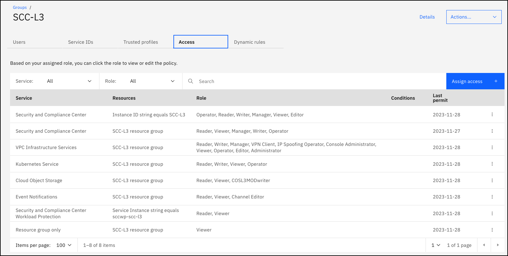

# SalesEnablement-SCC-L3
Repo for IBM Cloud Security and Compliance Center Level 3 training

**Last publish date:** 2023

**ITZ Collection:** https://techzone.ibm.com/collection/ibm-cloud-scc-level-3

**ITZ Environment:** https://techzone.ibm.com/my/reservations/create/64de5ecaf66f0b0017fa452a

**ITZ gitops pattern:** https://github.ibm.com/dte2-0/ccp-gitops-patterns/tree/main/ibm-scc-se-l3

ITZ account: ITZ - ADHOC03

## Summary of environment and automation

For this lab, no new resource are provisioned. The lab consists of many click-thru demonstrations, pre-provisioned instances of SCC, ....

In the ITZ automation:

- users are added to the above ITZ account
- users are added to the SCC-L3 IAM access group. The access group has the following access roles/policies defined:

## Maintenance

Verify the following resources are available (https://cloud.ibm.com/security-compliance/crn%3Av1%3Abluemix%3Apublic%3Acompliance%3Aus-south%3Aa%2Fba0e33c9056f470ca19de009747ec654%3A8b744abd-ca79-48c0-b82c-0b22f1663a8b%3A%3A/overview):

**Instance:** SCC-L3 (us-south)

**Attachments:** SCC-L3-CIS - DO NOT DELETE, SCC-L3-fs-attachment - DO NOT DELETE, SCC-L#-attachment - DO NOT DELETE, IKS benchmark attachment - DO NOT DELETE

**Profiles:** scc-l3-cis-DO-NOT-DELETE, se-scc-l3-DO-NOT-DELETE 

**Libraries:** SCC-L3-control-lib

**Rules:** Verify VPC IP spoofing is disabled.

**Integrations**: ToROKSCluster (SCC workload protection)

**Settings->Storage:** COS instance: COS-SCC-L3 COS Bucket: scc-l3-bucket

**Settings->Event Notifications:** eventnotifications-scc-l3

**IKS clusters**: scc-l3-iks-DO-NOT-DELETE
scc-l3k8s-cluster - need to see who created this and if it can be removed. I don't think it is actively used in the lab.

**Workload Protections->Git Integrations:** Robot-shop

**VSIs:** scc-l3-test-vsi, scc-test-vsi-do-not-delete

Users are instructed to create and remove several resources while executing this lab. You should check that this is being done.

1. Go to SCC Profiles for the SCC-L3 instance, sort on "type" and remove any **Custom** profile that is > 2weeks old and is not one of the above listed pre-provisioned profiles.

2. Go to SCC Control libraries for the SCC-L3 instance, sort on "type" and remove any **Custom** profile that is > 2weeks old and is not one of the above listed pre-provisioned libraries.

3. Go to SCC Rules for the SCC-L3 instance, sort on "type" and remove any **Custom** profile that is > 2weeks old and is not one of the above listed pre-provisioned rules.

4. Verify the **scc-l3-iks-DO-NOT-DELETE** IKS cluster is active and in the normal state.

5. Remove any old (>2 weeks) VSIs in the VPC. Most users will create their VSI in the Dallas region, but you should check all the regions.  Any VSI in the *SCC-L3* resource group that is > 2 weeks should be removed. You can check this by looking at the dates of each VSI, or comparing the VSI name with the list of current users in the SCC-L3 IAM access group, or you can run the following commands in a cloud shell instance or on your machine if you have the IBM Cloud CLI's installed (along with VPC plugin). The script assumes you are authenticated (ibmcloud login -sso).

6. Event notifications
