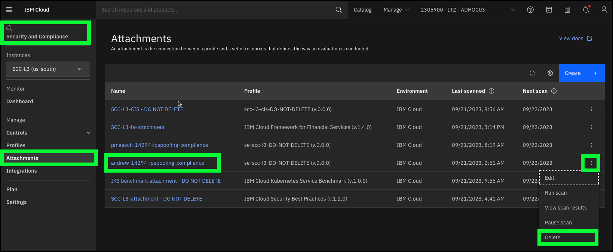
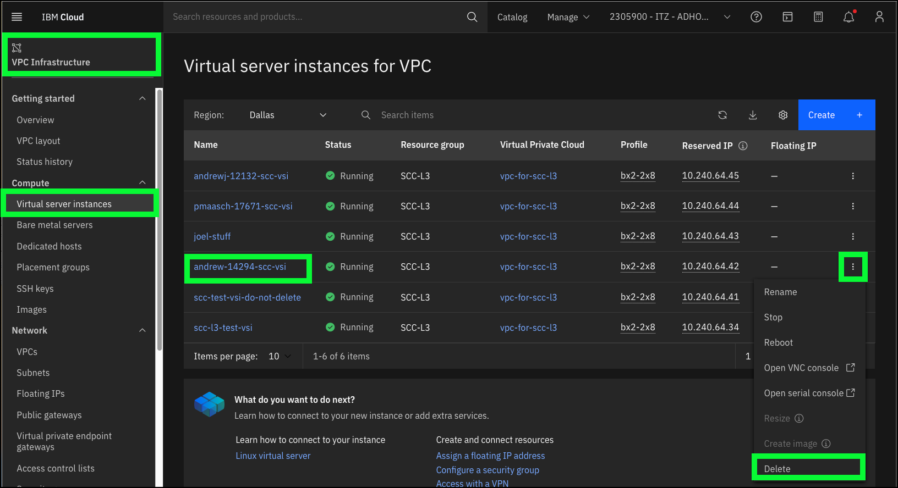
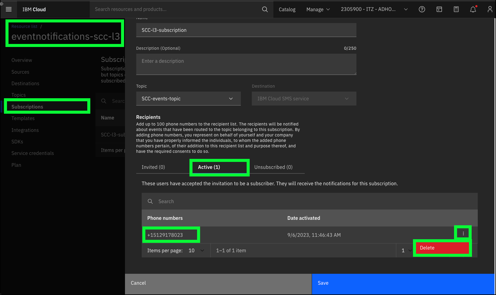

That concludes this part of the {{learningplan.Name}}. 

!!! Important "Delete any resources that you created!"

    The IBM Technology Zone (ITZ) environment you used is shared by everyone using this learning plan. Please remove all resources you may have created in completing the course, like SCC attachments and Virtual Server Instances (VSIs). If you configured SCC to send SMS messages to your mobile device, be sure to unsubscribe or remove our mobile devices number from Event Notifications to avoid receive additional messages. Do not delete the entire subscription!

    

    

    

!!! Important "Unsubscribe to Event Notifications!"
    
    If you enabled SMS messaging, simply click the unsubscribe link on any of the SMS messages you received on your mobile device and follow the directions to unsubscribe.

This demonstration guide only touched on part of the SCC capabilities. As mentioned in the Welcome section, another excellent resource is the <a href="https://pages.github.ibm.com/IBM-Cloud-Satellite-and-PaaS-Community/technology-pattern-scc/" target="_blank">IBM Technology Patterns for Regulated Cloud workloads</a>. Be sure to check it out!

Remember to complete the {{learningplan.Name}} learning plan:

**IBMers**  must complete a Stand and Deliver exercise to validate their ability to demonstrate {{offering.Name}} to potential clients. Refer to the evaluation checklist in the <a href="{{learningplan.YLurlTechSales}}" target="_blank">learning plan</a> when preparing the Stand and Deliver.

**Business Partners** (both sellers and technical sellers) must pass the {{learningplan.Name}} quiz found in the learning plan <a href="{{learningplan.BPurlTechSales}}" target="_blank">here</a>. The Business Partner quiz verifies use of the demonstration environment, and not one's general knowledge of the offering. You are strongly encouraged to use the ITZ environment while taking your quiz.
  
If you have feedback, please add comments in the above learning systems, or reach out directly to the authors of this course via Slack in the <a href="https://ibm-technology-sales.slack.com/archives/C03PQ47KRQE" target="_blank">#cloud-platform-demo-feedback</a> channel or directly to <a href="https://ibm.enterprise.slack.com/user/@W4EF1M0MT" target="_blank">@andrewj</a>.