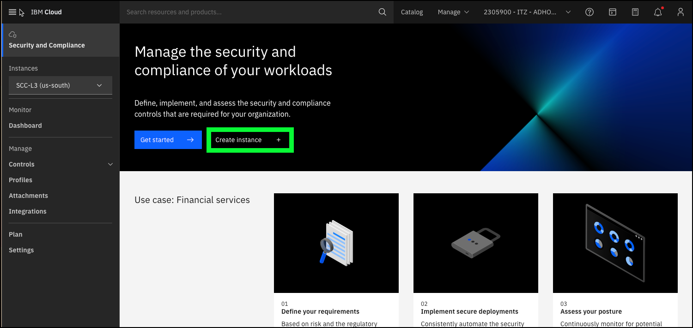
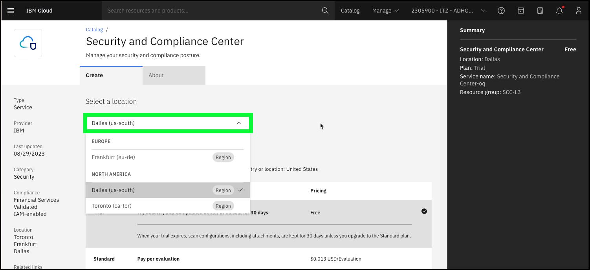
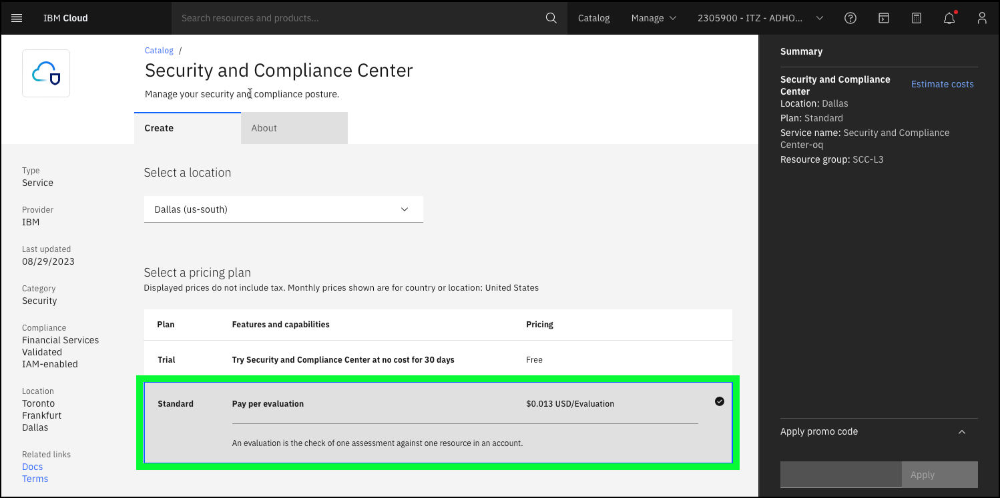
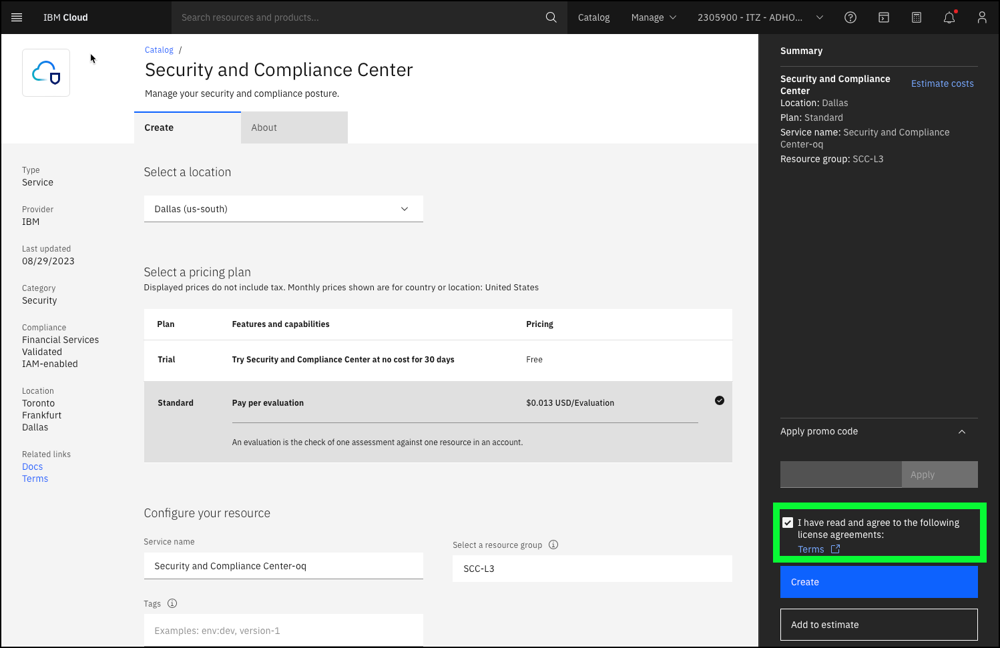
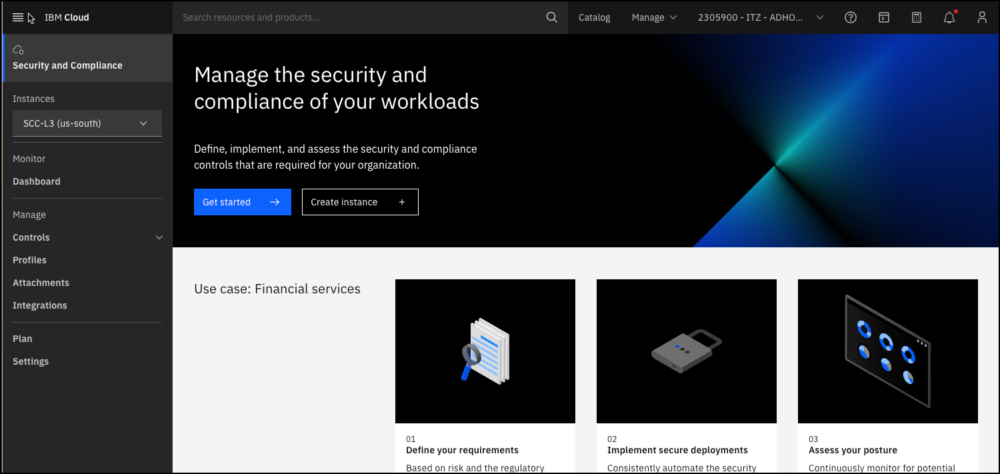

Demonstrations should resonate with the audience. It is important to know your audience and the roles they have within their company when preparing and delivering your demonstrations. The demonstration steps provided below may not resonate with all user roles. For instance, the Chief Risk Officer (CRO) may not be concerned about how to provision and instance fo IBM Cloud Security and Compliance Center (SCC), but members of the CRO's technical staff tasked with doing so will. Some individuals will be focused on the aspects of compliance related to their code development while others will be focus on the infrastructure the applications run on in production. When planning a client demonstration focus on the most important aspects of the offering to the audience in attendance and be selective on the aspects of the SCC suite of offerings you choose to show.

## Explore provisioning an SCC instance

In this phase of the demo, you will be using a baking show approach to show how an IBM Cloud Security and Compliance Center (SCC) instance and related resources are provisioned. As mentioned earlier, you will not be provisioning these resources, rather you will utilize pre-provisioned resources. As mentioned earlier, this scenario may be of interest to only a few individuals in the client's organization and may be skipped if not demonstrating to the technical team that will be responsible for deploying SCC.

1. Open a web browser to the **IBM Cloud Portal**.

<a href="https://cloud.ibm.com" target="_blank">IBM Cloud Portal</a>.

When the page loads, authenticate with your IBM Cloud ID and password. The authentication process varies depending on the primary account that your ID is associated with and any multi-factor authentication or other security controls in place for the account.

2. Click the **account selection** drop-down menu and select the **{{itz.account}}** account.

Note, if the browser window is narrow, you might see an **account selection** icon like this:  instead of the full account name.

3. Click the **Security and Compliance** icon () in the menu bar.
   

4. Click **Create instance+**.

5. Click the **Select a location** drop-down menu.

**Discussion points:** SCC instances are specific to IBM Cloud regions. As shown in the portal, SCC is currently available in three regions. Look for additional regions to be added in the future based upon client demands.

6. Select the **Dallas (us-south)** location.
7. Click the **Standard** pricing plan.

**Discussion points:** SCC provides a trial pricing plan, which allows clients to try SCC at no cost for 30 days. The standard pricing plan is based upon the number of **evaluations** performed. Clients are charged if an evaluation produces a result of pass or fail. Charges are not incurred for the evaluation if the check cannot be performed or is not applicable. Each scan that is run provides with the number of billable evaluations in the results user interface (UI). More information on SCC pricing can be found <a href="https://cloud.ibm.com/docs/security-compliance?topic=security-compliance-scc-pricing&interface=ui" target="_blank">here</a>. IBM Cloud Security and Compliance Center Workload Protection (WP) has a different pricing model. WP is priced hourly based on the number of nodes protected. More information about WP pricing can be found <a href="https://cloud.ibm.com/docs/workload-protection?topic=workload-protection-pricing_plans" target="_blank">here</a>.

8. Click the **I have read and agree to the following license agreements** checkbox.

**Discussion points:** That is all the information required to create an SCC instance. You could discuss the use of resource groups, tags, and access management tags which are used to organize and control access cloud resources. Provisioning the instances typically takes under a couple of minutes. Inform your audience that you will now switch to an existing SCC instance. 

9. Click the browser's back button to return to the **Security and Compliance** overview page.

Note, if you click **Create** in the **{{itz.account}}** account, you will receive an error. 

### SCC configuration and integration phase

Before using SCC, a few additional steps need to be performed. First, a IBM Cloud Object Storage (COS) bucket needs to be assigned to the SCC instance. COS is used to store the results of scans performed by SCC. The process of provisioning COS and assigning a bucket to SCC is not covered in this guide. To learn more about the process, consult the documentation <a href="https://cloud.ibm.com/docs/security-compliance?topic=security-compliance-storage&interface=ui" target="_blank">here</a>.

Workload Protection (WP) is a core part of the SCC suite but is provisioned and configured separately. This integration is already done in this ITZ environment and will be part of the demonstration steps below. To learn more about WP, how it is provisioned, and how to integrate with SCC, check out the documentation <a href="https://cloud.ibm.com/docs/workload-protection?topic=workload-protection-getting-started" target="_blank">here</a>.

## Configure, initiate, and view scan results

## Clean up

<!-- Should add a section for tech sales to cover IAM settings, use demo environment as an example. 
https://cloud.ibm.com/docs/security-compliance?topic=security-compliance-assign-roles

also
https://cloud.ibm.com/docs/security-compliance?topic=security-compliance-access-management&interface=ui
-->

<!-- mention event notifications https://cloud.ibm.com/docs/security-compliance?topic=security-compliance-event-notifications&interface=ui -->

<!-- can we use this as the flow: https://cloud.ibm.com/docs/security-compliance?topic=security-compliance-scan-resources&interface=ui -->

<!-- for reading dashboard, refer to:https://cloud.ibm.com/docs/security-compliance?topic=security-compliance-results&interface=ui

Success rate
    The rate at which your configurations pass the evaluation that is conducted. Note: The number of evaluations conducted does not always match the number of billable evaluations, as there is no charge for assessments evaluated as unable to perform. Be sure to look for the billable evaluations in each scan result if you need to estimate your cost.
Total controls
    The total number of controls that have been evaluated in the past 30 days.
Total evaluations
    The total number of evaluations that have been run in the past 30 days. An evaluation is the check of one resource against one assessment.  -->

    <!-- if we split out a tech sales section, consider talking about multi-tenant aspect of SCC and refer them to this documentation: https://cloud.ibm.com/docs/security-compliance?topic=security-compliance-compute-isolation&interface=ui 
    
    additionally, integration with Activity Tracker: 
    https://cloud.ibm.com/docs/security-compliance?topic=security-compliance-at_events&interface=ui
   
   and context-based restrictions: https://cloud.ibm.com/docs/security-compliance?topic=security-compliance-cbr&interface=ui
   
    -->

    <!-- Event notification - add their cell phone number to receive SMS alerts of scan's complete -->