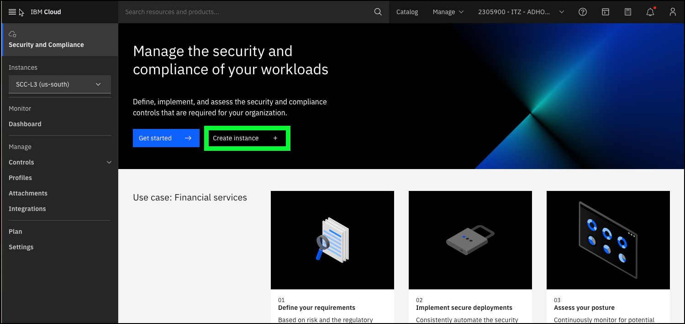
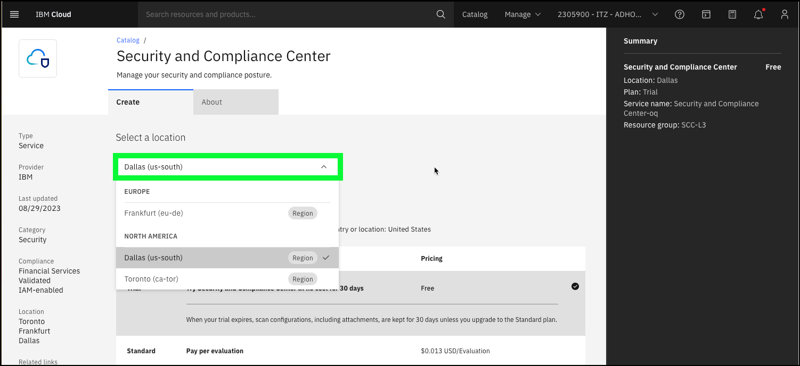
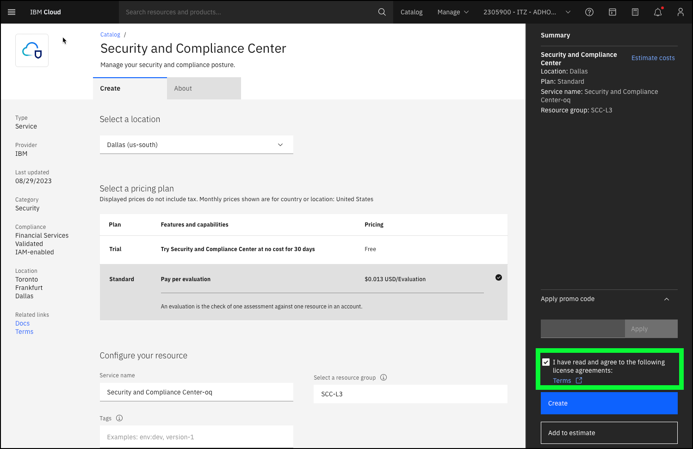

In this demonstration flow, you will be using a baking show approach to show how an IBM Cloud Security and Compliance Center (SCC) instance and related resources are provisioned. You will not be provisioning these resources, rather you will utilize pre-provisioned resources. **As mentioned earlier, this scenario may be of interest to only a few individuals in the client's organization and may be skipped if not demonstrating to the technical team that will be responsible for deploying SCC.**

1. Open a web browser to the **IBM Cloud Portal**.

<a href="https://cloud.ibm.com" target="_blank">IBM Cloud Portal</a>.

When the page loads, authenticate with your IBM Cloud ID and password. The authentication process varies depending on the primary account that your ID is associated with and any multi-factor authentication or other security controls in place for the account.

2. Click the **account selection** drop-down menu and select the **{{itz.CloudAccount}}** account.

Note, if the browser window is narrow, you might see an **account selection** icon like this:  instead of the full account name.

3. Click the **Security and Compliance** icon () in the menu bar.
   

4. Click **Create instance+**.

5. Click the **Select a location** drop-down menu.

**Discussion points:** SCC instances are specific to IBM Cloud regions. As shown in the portal, SCC is currently available in three regions. Look for additional regions to be added in the future based upon client demands.

6. Select the **Dallas (us-south)** location.
7. Click the **Standard** pricing plan.

**Discussion points:** SCC provides a trial pricing plan, which allows clients to try SCC at no cost for 30 days. The standard pricing plan is based upon the number of **evaluations** performed. Clients are charged if an evaluation produces a result of pass or fail. Charges are not incurred for the evaluation if the check cannot be performed or is not applicable. Each scan that is run provides with the number of billable evaluations in the results user interface (UI). More information on SCC pricing can be found <a href="https://cloud.ibm.com/docs/security-compliance?topic=security-compliance-scc-pricing&interface=ui" target="_blank">here</a>. IBM Cloud Security and Compliance Center Workload Protection (WP) has a different pricing model. WP is priced hourly based on the number of nodes protected. More information about WP pricing can be found <a href="https://cloud.ibm.com/docs/workload-protection?topic=workload-protection-pricing_plans" target="_blank">here</a>.

8. Click the **I have read and agree to the following license agreements** checkbox.

**Discussion points:** That is all the information required to create an SCC instance. You could discuss the use of resource groups, tags, and access management tags which are used to organize and control access cloud resources. Provisioning the instances typically takes under a couple of minutes. Inform your audience that you will now switch to an existing SCC instance. 

9. Click the browser's back button to return to the **Security and Compliance** overview page. If you click **Create** in the **{{itz.CloudAccount}}** account, you will receive an error. 

### SCC configuration and integration phase

Before using SCC, a few additional steps need to be performed. First, a IBM Cloud Object Storage (COS) bucket needs to be assigned to the SCC instance. COS is used to store the results of scans performed by SCC. The process of provisioning COS and assigning a bucket to SCC is not covered in this guide. To learn more about the process, consult the documentation <a href="https://cloud.ibm.com/docs/security-compliance?topic=security-compliance-storage&interface=ui" target="_blank">here</a>.

Workload Protection (WP) is a core part of the SCC suite but is provisioned and configured separately. This integration is already done in this ITZ environment and will be part of the demonstration steps that follow. To learn more about WP, how it is provisioned, and how to integrate with SCC, check out the documentation <a href="https://cloud.ibm.com/docs/workload-protection?topic=workload-protection-getting-started" target="_blank">here</a>.

Watch a video of the above scenario:

