The remediation flow builds upon the setup performed earlier in the **Configure remediation scenario** chapter of the **Demonstration Environment** section of the demonstration guide. This flow tells the story of remediating a compliance failure and viewing the improved results in IBM Security and Compliance Center (SCC).

??? Warning "Before proceeding to this step, make sure at least one (1) full hour passed since you initially created your custom attachment."

    It is important to understand that SCC cache's scan results for one hour. This means if you run the same scan within an hour of the last time the scan was run, a new scan is NOT performed and the old results are returned. This is important to remember when performing a client demonstration or if you are recording your Stand and Deliver.

1. Open a web browser to the **IBM Cloud Portal**.

<a href="https://cloud.ibm.com" target="_blank">IBM Cloud Portal</a>.

When the page loads, authenticate with your IBM Cloud ID and password. The authentication process varies depending on the primary account that your ID is associated with and any multi-factor authentication or other security controls in place for the account.

2. Click the **account selection** drop-down menu and select the **{{itz.CloudAccount}}** account.

Note, if the browser window is narrow, you might see an **account selection** icon like this:  instead of the full account name.

3. Click the **Security and Compliance** icon () in the menu bar.
   

4. Click **Attachments** in the left menu.

5. Click the ellipses icon () of the **Attachment** that you created earlier and then click **View scan results**. In this example, **andrew-14294-ipspoofing-compliance**.

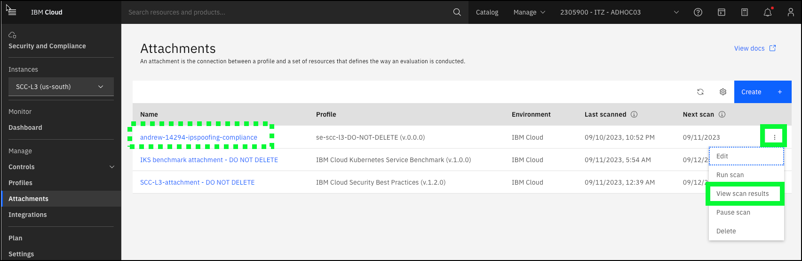

6. Click the link for the last scan run.

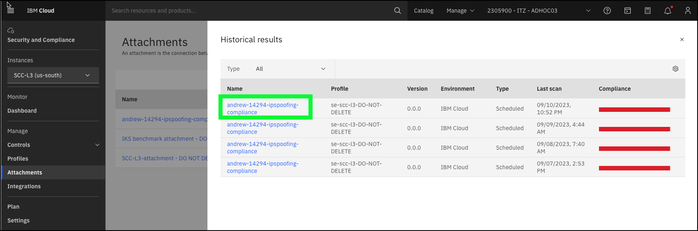

Describe to the audience the simplified attachment that you created earlier that has a single control that is being evaluated and that the control failed. 

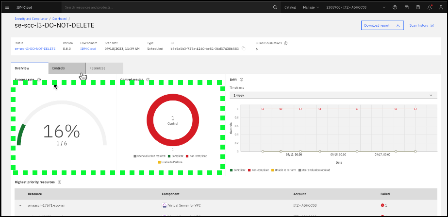

Note, the success rate percentage will likely be different in the IBM Portal than shown here.

7. Click the **Controls** tab.

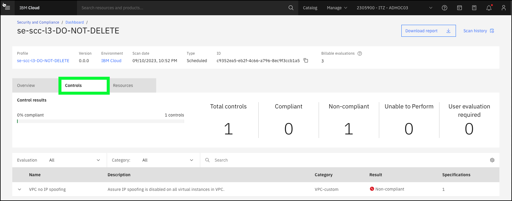

Describe how this custom profile was created by using a single control from one of the pre-defined profiles. In this case, the control is the check to see whether IP spoofing is enabled for any VSIs in VPCs.

8. Click the **Resources** tab and then the down arrow icon () next to the VSI that you created earlier.

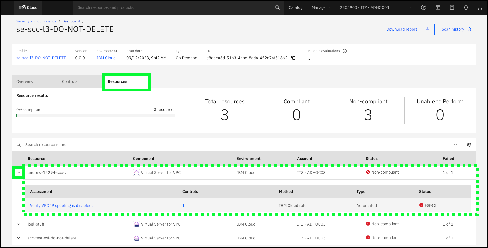

Describe how the table shows the VSIs that are not in compliance. Now, it is time to remediate the issue for at one of the VSIs.

Note: your view of resources that have failed will vary based upon others using the environment.

9. Click the hamburger menu icon () and then click the VPC icon.

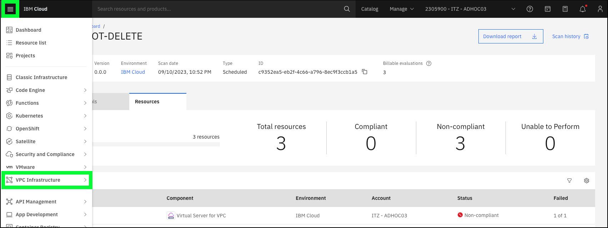

10. Click **Virtual server instances** under the **Compute** heading in the left menu.

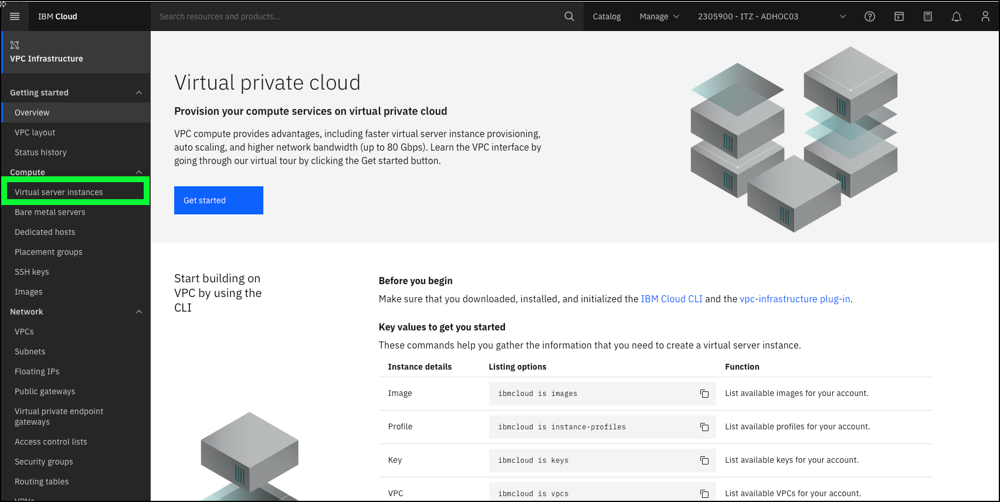

11. Click the name of the VSI that you created earlier. In this example, **andrew-14294-scc-vsi**.

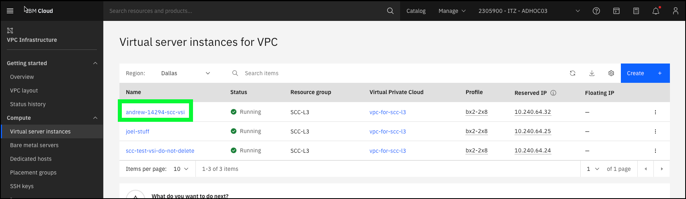

12. Scroll down to the **Network interfaces** section.

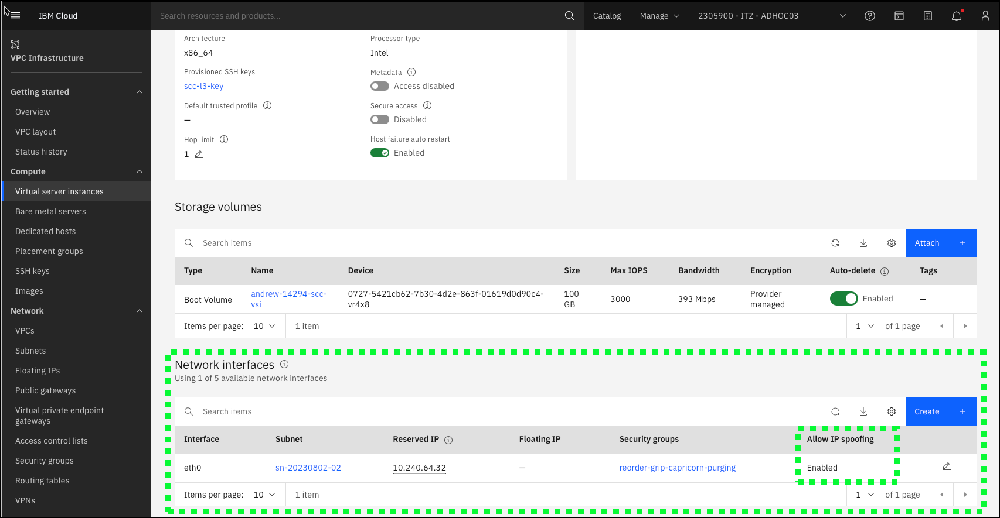

Note: your view of VSI resources will vary based on others using the environment.

Show the audience that the current networking setting for this VSI has IP spoofing enabled and that to fix the compliance issue, it needs to be disabled.

13. Click the pencil icon () to edit the network interface settings.

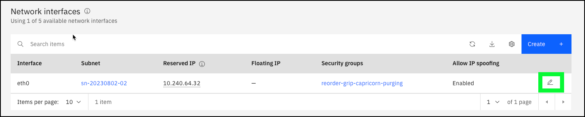

14. Click the **Allow IP spoofing** toggle to change the setting from Enabled to **Disabled** and click **Save**.

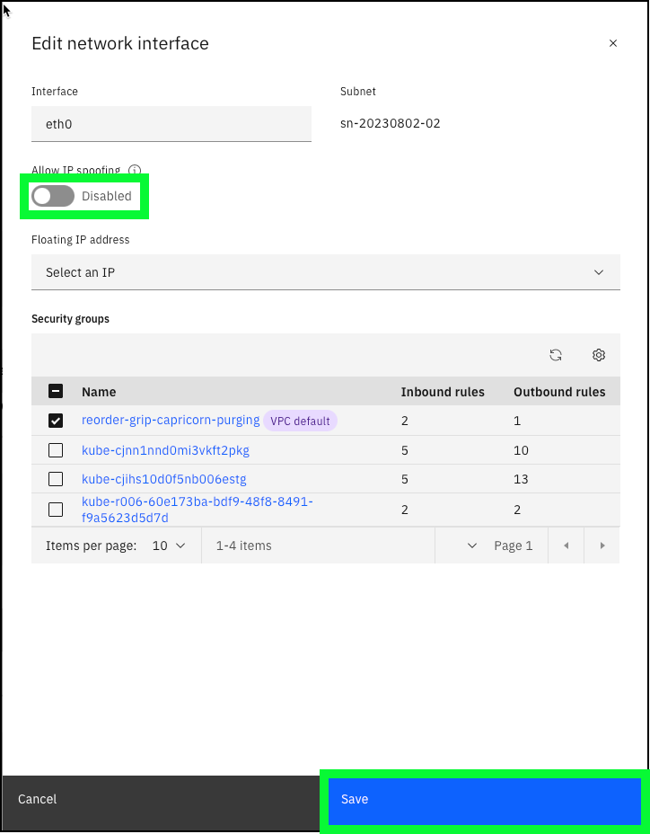

The issue is remediated, so it is time to rerun the scan.

15. Click the hamburger menu icon () and then click the Security and Compliance option.

16. Click **Attachments** in the left menu.

17. Click the ellipses icon () of the **Attachment** that you created earlier and then click **Run scan**. In this example, **andrew-14294-ipspoofing-compliance**.

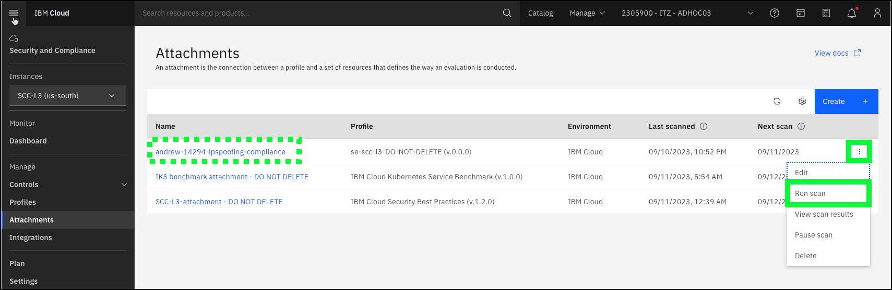

18. Click **Run scan** in the **Scan now** popup window.

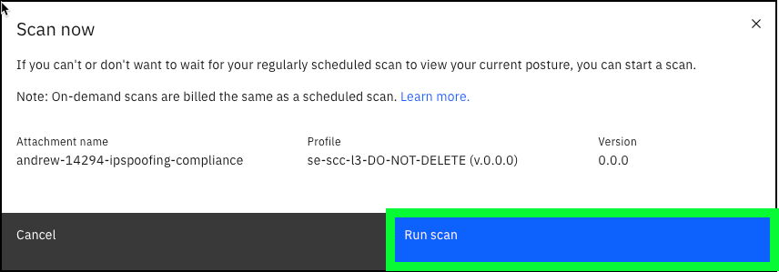

The **Scan in progress** message appears for the attachment. 

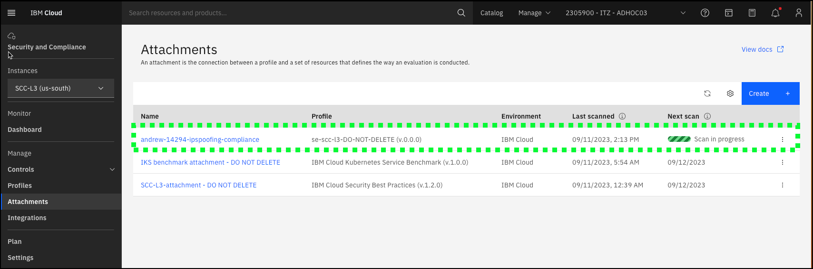

While waiting for the scan to complete, fill the time to answer any questions, or if you enabled Event Notifications, describe that integration.

If you enabled Event Notifications with your mobile device number, you will receive an SMS message like: "Scan complete - at least 1% of controls were noncompliant. 

After a minute or two, or after receiving the SMS notification, click the browser's refresh button.

Once the scan is complete, proceed.

19.  Click the ellipses icon () of the **Attachment** that you created earlier and then click **View scan results**. In this example, **andrew-14294-ipspoofing-compliance**.

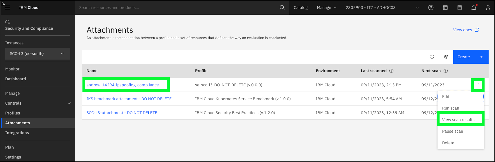

20. Click the first scan in the table.

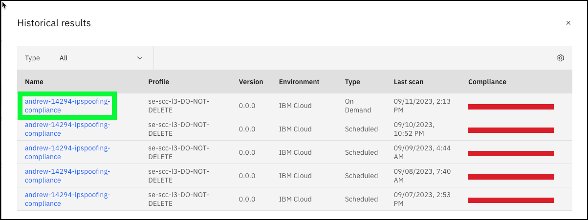

21. Discuss the new scan results.

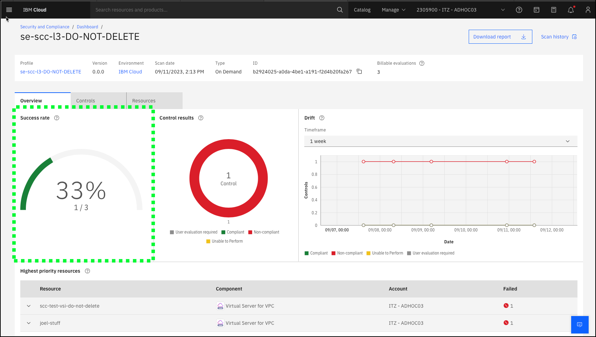

Notice the difference in the **Success rate** graphic. The value should have increased from the previously viewed scan. In this case, it went from 0% to 33% that represents the remediation performed on one of the VSIs that were noncompliant in the IP spoofing control.

Notice, the **drift** did not change as the drift chart is based on the compliance of the control across all resources.

Watch a video of the scenario:

