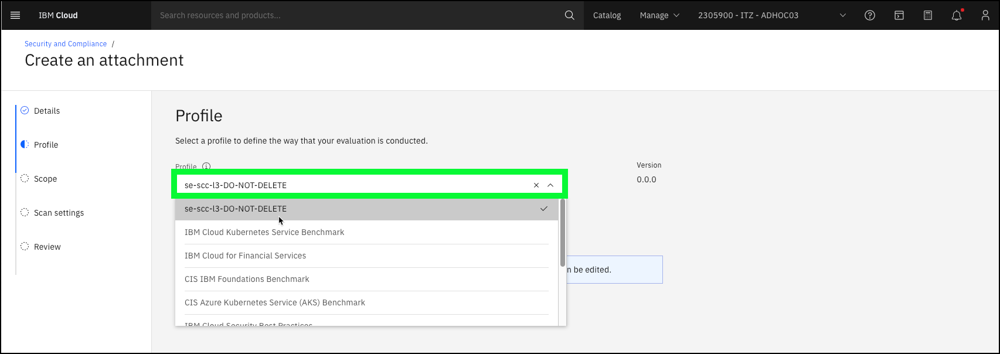
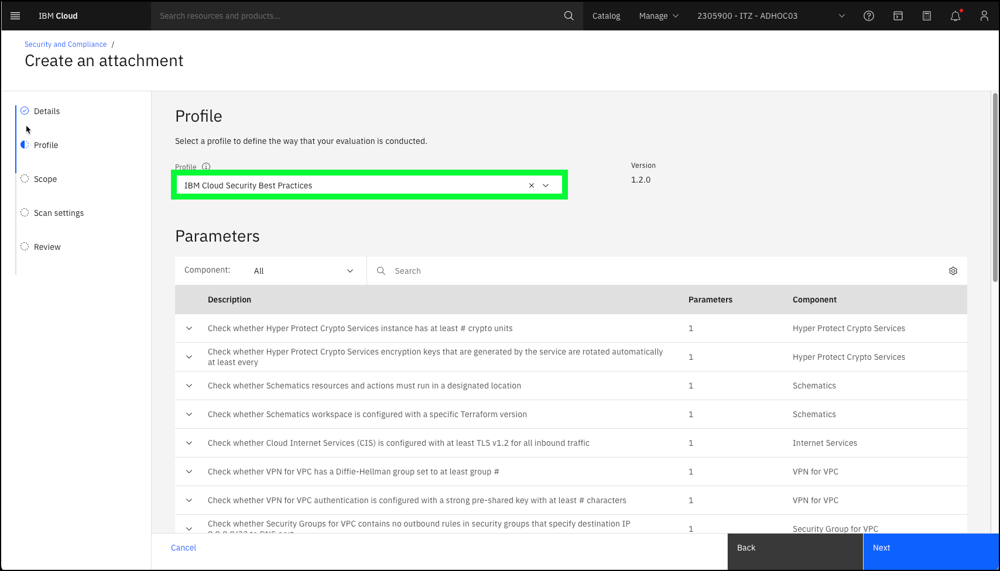
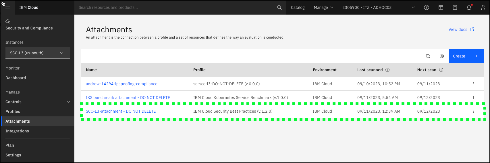
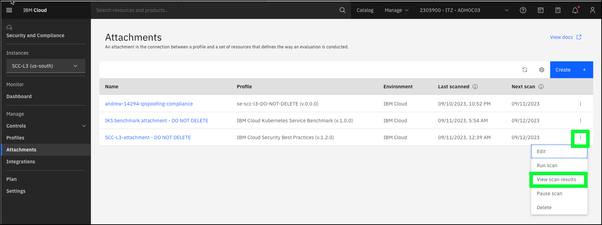
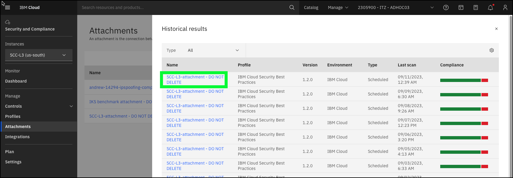
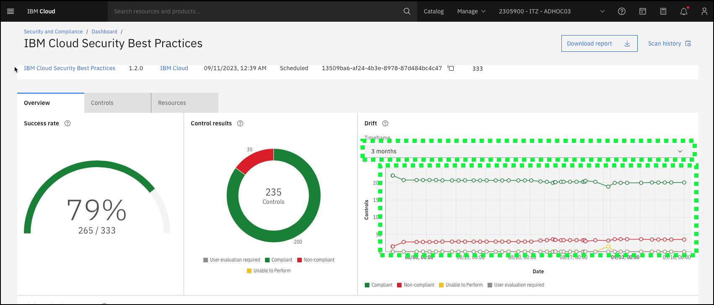
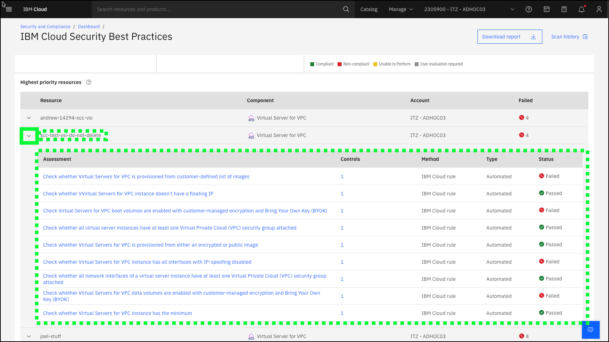

This demonstration flow provides an high-level overview of IBM Cloud Security and Compliance Center (SCC). It introduces the key concepts of controls, profiles, and attachments and illustrates how to use the SCC Dashboard and review SCC scan results. 

1. Open a web browser to the **IBM Cloud Portal**.

<a href="https://cloud.ibm.com" target="_blank">IBM Cloud Portal</a>.

When the page loads, authenticate with your IBM Cloud ID and password. The authentication process varies depending on the primary account that your ID is associated with and any multi-factor authentication or other security controls in place for the account.

2. Click the **account selection** drop-down menu and select the **{{itz.CloudAccount}}** account.

Note, if the browser window is narrow, you might see an **account selection** icon like this:  instead of the full account name.

3. Click the **Security and Compliance** icon () in the menu bar.
   

The SCC overview page in the IBM Cloud Portal provides a good starting point for demonstrations.

Introduce SCC in an impactful way that will resonate with the audience. For example, discuss recent news stories related to the client's main industry and compliance failures.

Describe the benefits of SCC, for example, SCC helps protect organizations from financial and civil penalities by identifying misconfigurations and addressing compliance issues both on premises and in the cloud. SCC does this by conducing scans of the client's environment.

To run a scan an attachment must first be created.

4. Click the **Get started** button.

5. Enter **testscan** in the **Name** field and click **Next**

6. Click the **Profile** pull down.

Scroll through the pre-defined profiles provided by SCC and describe the most relevant profiles to the client. For example, if the client is in the financial industry, spend some time describing the IBM Cloud for Financial Services profile which is developed and maintained by IBM and leading financial institutions. To learn more about the pre-defined profiles, visit the product documentation <a href="https://cloud.ibm.com/docs/security-compliance?topic=security-compliance-predefined-profiles&interface=ui" target="_blank">here</a>. Note, the acronym CIS stands for **Center for Internet Security**: <a href="https://www.cisecurity.org" target="_blank">https://www.cisecurity.org</a>. 

7. Select the **IBM Cloud Security Best Practices** profile or one of the other pre-defined ones if more appropriate for your client.

Describe how **profiles** are composed of a set off **controls** which define rules for evaluating the configurations of resources.

Expand one of the controls and describe the compliance check this control performs.

8. Click the down arrow () next to the **Check whether Virtual Servers for VPC instance has all interfaces with IP-spoofing disabled.** and then click the **JSON** tab.

Each control has a specification, in this case "Check whether Virtual Servers for VPC instance has all interfaces with IP-spoofing disabled" and rules that checks for the desired state against a resource.

8. Click **Next**.
9. Click the **Scope** pull-down menu.

The scope defines which resources will be evaluated against the controls in the profile.Describe how scan's can be scoped to an account or a resource group. IBM Cloud enterprise accounts have further capabilities to scope at the sub-account or account groups. 

10. Click **{{iam.ResourceGroup}} and then click **Next**.

11. Click **Next** on the **Scan settings** page.

The scan settings pages allows you to enable or disable the scan, set the schedule for the scan, and enable notifications.  We will cover the **Notifications** in a later demonstration flow.

12. Review the attachment settings.

Described that the time to take to run a scan depends on the number of controls specified and the scope which defines what resources are to be scanned. Given a scan against the IAM Cloud Security Best Practices will take several minutes, let the audience know that you will now switch to an attachment created earlier with the same parameters.

13. Click **Cancel** and then click **Cancel on the confirmation dialog that pops up.

14. Click **Attachments** in left-hand menu.

Highlight to the audience the attachment named **SCC-L3-attachment - DO NOT DELETE**.

This attachment scans for the compliance controls specified in the IBM Cloud Security Best Practices profile. 

15. Click the ellipses icon () for the **SCC-L3-attachment - DO NOT DELETE** entry and then click **View scan results**.

16. Click the most recent (top of list) scan results in the table.

The overview page shows the results of the scan that was run. Use the following definitions to describe the results to the audience.

Success rate - % of evaluations that returned a compliant result.

Evaluation - assessment of a specific control to a specific resource.

**Assessment** - The actual evaluation of a configuration for compliance with applicable standards. An assessment can be either automated or manual depending on the control.

17. Click the **Timeframe** pull-down menu for the **Drift** graphic and select a timeframe to best visualize drift.

This scan was originally setup in early August 02, 2023. After the original scan, several remediation steps were taken to resolve some of the non-compliant checks.  To best show the **drift** in compliance select a the shortest time frame that brings August 02, 2023 into view. For example,select **3 months** if you are running before the end of October, 2023, otherwise select 6 months or 1 year.

Describe how the Drift view provides a nice visual for the compliance status of the environment over a period of time. It is easy to see where improvements were made and perhaps where some compliance ground was lost.

The bottom table shows individual resources that have failed an evaluation.

18. Click the down arrow icon () next to the **scc-test-vsi-do-not-delete** resource in the table.

This view shows all the evaluations that passed and failed for a particular resource, in this case a Virtual Server Instance (VSI) in a Virtual Private Cloud (VPC) on IBM Cloud. From here, remediation can begin to improve compliance posture. 

19. Click the **Controls** tab and then click **Non-compliant** in the Evaluation drop-down menu in the table.

There are various views (by Control, by Resource, etc) and filters that can be applied to the output to visualize where issues are in the environments compliance posture and a starting point in understanding where to focus effort in terms of implementing security and compliance measures to remediate potential vulnerabilities.

Watch a video of the above scenario:

