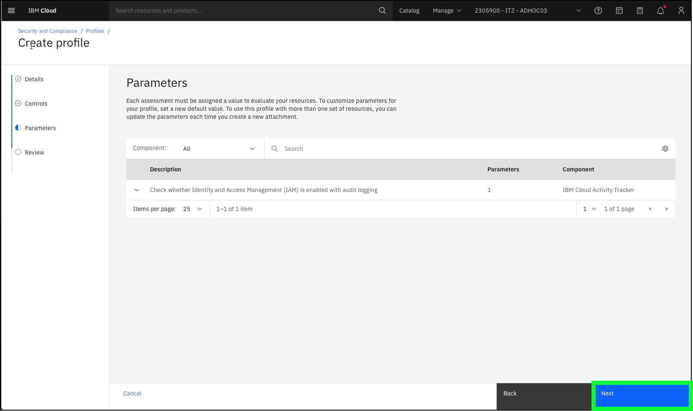

This demonstration flow provides a high-level overview of IBM Cloud Security and Compliance Center (SCC). It introduces the key concepts of controls, profiles, and attachments and illustrates how to use the SCC Dashboard and review SCC scan results. 

1. Open a web browser to the **IBM Cloud Portal**.

<a href="https://cloud.ibm.com" target="_blank">IBM Cloud Portal</a>.

When the page loads, authenticate with your IBM Cloud ID and password. The authentication process varies depending on the primary account that your ID is associated with and any multi-factor authentication or other security controls in place for the account.

2. Click the **account selection** drop-down menu and select the **{{itz.CloudAccount}}** account.

Note, if the browser window is narrow, you might see an **account selection** icon like this:  instead of the full account name.

3. Click the **Security and Compliance** icon () in the menu bar.
   

The SCC overview page in the IBM Cloud Portal provides a good starting point for demonstrations.

Introduce SCC in an impactful way that resonates with the audience. For example, discuss recent news stories that are related to the client's main industry and compliance failures.

Describe the benefits of SCC, for example, SCC helps protect organizations from financial and civil penalities by identifying misconfigurations and addressing compliance issues both on premises and in the cloud. SCC does this by conducting scans of the client's environment.

To run a scan, an attachment must first be created.

4. Click the **Get started** button.

5. Enter **testscan** in the **Name** field and click **Next**

6. Click the **Profile** pull-down.

Scroll through the pre-defined profiles that are provided by SCC and describe the most relevant profiles to the client. For example, if the client is in the financial industry, spend some time describing the IBM Cloud for Financial Services profile that is developed and maintained by IBM and leading financial institutions. To learn more about the pre-defined profiles, visit the product documentation <a href="https://cloud.ibm.com/docs/security-compliance?topic=security-compliance-predefined-profiles&interface=ui" target="_blank">here</a>. These profiles along with the related control libraries are updated on a regular basis. Learn about the latest updates in the <a href="https://cloud.ibm.com/docs/security-compliance?topic=security-compliance-release-notes&interface=ui" target="_blank">**release notes**</a>. Note, the acronym CIS stands for **Center for Internet Security**: <a href="https://www.cisecurity.org" target="_blank">https://www.cisecurity.org</a>. The CIS IBM Cloud Foundations Benchmark is the product of a community consensus process and consists of secure configurations guidelines that are developed for IBM Cloud. You can learn more about the benchmark <a href="https://www.cisecurity.org/benchmark/ibm_cloud" target="_blank">here</a>.

!!! Note "Profile name changes"

    In the September 23, 2023 release update for SCC, several of the profile names were updated with minor changes. For example, CIS IBM Foundations Benchmark was renamed to CIS IBM *Cloud* Foundations Benchmark. These updates may not be reflected in the image captures provided in this demonstration guide.

7. Select the **CIS IBM CLoud Foundations Benchmark** profile or one of the other pre-defined ones if more appropriate for your client.

Describe how **profiles** are composed of a set off **controls**, which specify the specifications and rules for evaluating the configuration of affected resources.

Expand one of the controls and describe the compliance check that this control performs.

8. Click the down arrow () next to the **Check whether Cloud Internet Services (CIS) is configured with at least TLS v1.2 for all inbound traffic.** and then click the **JSON** tab.

Each control has one or more specifications, in this case "Check whether Cloud Internet Services (CIS) is configured with at least TLS v1.2 for all inbound traffic" and rules that check for the desired state against a resource.

Click the **Parameters** tab to see the default parameters used in the rule.

9. Click **Next**.
10.  Click the **Scope** pull-down menu.

The scope defines which resources will be evaluated against the controls in the profile. Describe how scan's can be scoped to an account or a resource group. IBM Cloud enterprise accounts have further capabilities to scope at the sub-account or account groups. 

11. Click **{{iam.ResourceGroup}} and then click **Next**.

12. Click **Next** on the **Scan settings** page.

The scan settings page allows you to enable or disable the scan, set the schedule for the scan, and enable notifications. We cover **Notifications** in a later demonstration flow.

13. Review the attachment settings.

Described that the time to take to run a scan depends on the number of controls that are specified and the scope that defines what resources are to be scanned. Given a scan against the IAM Cloud Security Best Practices take several minutes, let the audience know that you are switching to an attachment created earlier with the same parameters.

14. Click **Cancel** and then click **Cancel** on the confirmation dialog that pops up.

15. Click **Attachments** in the left menu.

Highlight the attachment named **SCC-L3-CIS - DO NOT DELETE**.

This attachment scans for the compliance controls specified in the IBM Cloud Security Best Practices profile. 

16. Click the ellipses icon () for the **SCC-L3-attachment - DO NOT DELETE** entry and then click **View scan results**.

17. Click the most recent (top of list) scan results in the table.

The overview page shows the results of the scan that was run. Use the following definitions to describe the results to the audience.

**Success rate** - The rate at which configurations pass the evaluation that is conducted. Note: The number of evaluations conducted does not always match the number of billable evaluations, as there is no charge
for assessments evaluated as unable to perform. 

**Evaluation** - assessment of a specific control to a specific resource.

**Assessment** - The actual evaluation of a configuration for compliance with applicable standards. An assessment can be either automated or manual depending on the control.

18. Click the **Timeframe** pull-down menu for the **Drift** graphic and select a timeframe to best visualize drift.

This scan was originally set up on August 13, 2023. After the original scan, several remediation steps were taken to resolve some of the noncompliant checks. To best show the **drift** in compliance select the shortest time frame that brings August 13, 2023 into view. For example, select **3 months** if you are running before the end of October  2023, otherwise select 6 months or 1 year.

Describe how the Drift view provides a nice visual for the compliance status of the environment over a time. It is easy to see where improvements were made and perhaps where some compliance ground was lost.

The bottom table shows individual resources that failed an evaluation.

19.  Click the down arrow icon () next to the **iam-identity** resource in the table.

This view shows all the evaluations that passed and failed for a particular resource, in this case Identity and Access Management (IAM). From here, remediation can begin to improve compliance posture. 

20. Click the **Controls** tab and then click **Non-compliant** in the Evaluation drop-down menu in the table.

There are various views (by Control, by Resource, and so on) and filters that can be applied to the output to visualize where issues are in the environment's compliance posture. This is a starting point in understanding where to focus effort in terms of implementing security and compliance measures to remediate potential vulnerabilities.

The steps that follow go into more detail regarding controls, control libraries, and profiles. 

21. Click the **Dashboard** link at the top of the page.

22. Click the **Controls** option and then **Control libraries** in the left menu.

Here we see the current control libraries that are provided by SCC. These controls and control libraries are maintained by IBM and are updated regularly.

The IBM Cloud for Financial Services control library has over 500 controls that are defined by IBM and industry-leading companies that are part of our Financial Services Advisory Council. We also have control libraries specific to cloud native applications and control libraries specific to cloud native applications on other clouds like AWS, Azure, and Google.

Note: the next steps use the CIS IBM Foundations Benchmark, but feel free to select a control library that best aligns with your client.

23. Click **CIS IBM Foundations Benchmark**.

Let’s look at the CIS IBM Foundations Benchmark library again.

Here we see the all the assessments that make up the library that is grouped by control, and we can view them grouped by component.

24. Click the **Grouped by component** tab.

25.  Click the **Security and Compliance** link at the top of the page.

26. Click **Profiles** in the left menu.

!!! Question "BP Quiz Question"

Recall when creating an attachment, a “profile” was specified and not a control library. Let’s look at profiles next. SCC supports both pre-defined and custom profiles. The pre-defined profiles are, for the most part, aligned with a control library. Before continuing, explore the pre-defined profiles that are currently available.

27.  Click **Create +**.

28. Enter **test** in the **Name** field and **test** in the **Description** field and then click **Next**

A version control system is available for profiles and control libraries to support updates and changes to controls and standards.

29. Click **Add +** on the **Controls** page.

Since not all controls might apply to a client's requirements, you can create custom profile based on one of the existing libraries.

30. Click **CIS IBM Foundations Benchmark** and then click **Next**.

31. Click a couple of the checkboxes to select individual controls and then click **Add**.

When building off an existing control library, clients can select just the controls that apply to their requirements. 

32. Click **Next**.

33. Click **Next**.

The profile can now be saved and used to create new attachments.

Do not create additional profiles in the shared ITZ environment.

34. Click **Cancel** and click **Cancel** on the confirmation pop-up dialog.

While you have permission to save new profiles, to avoid additional cleanup work at the end of this learning plan, click cancel.

In addition to creating custom profiles and custom control libraries, SCC supports the creation of custom rules. The topic of custom rules is not covered in this course, but you can find more information on the topic <a href="https://cloud.ibm.com/docs/security-compliance?topic=security-compliance-rules-define&interface=ui" target="_blank">here</a> and in the <a href="https://pages.github.ibm.com/IBM-Cloud-Satellite-and-PaaS-Community/technology-pattern-scc/" target="_blank">IBM Technology Patterns for Regulated Cloud workloads</a>.

Watch a video of this scenario:

Before continuing to the next chapter, explore all the options in the SCC dashboard.

!!! Question "BP Quiz Question"

