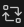
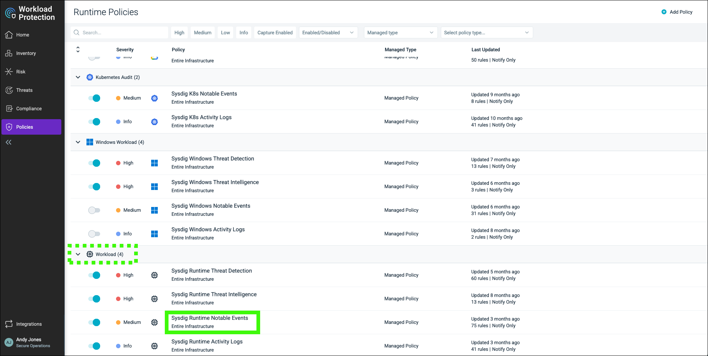
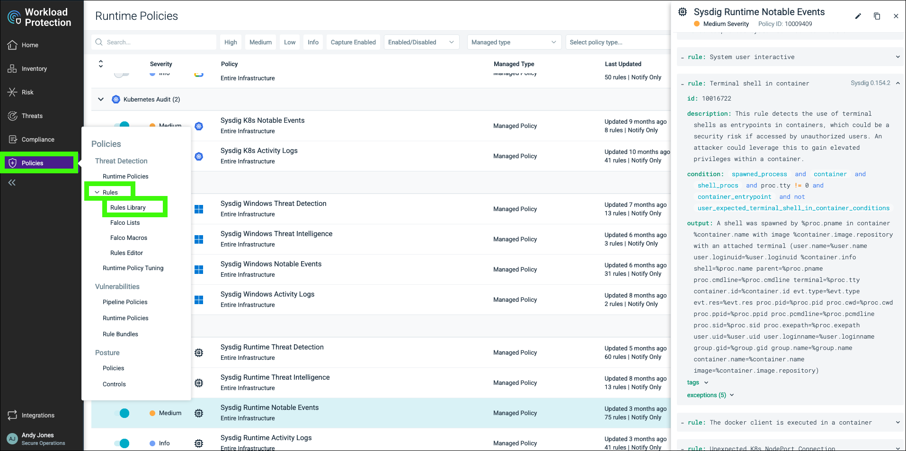
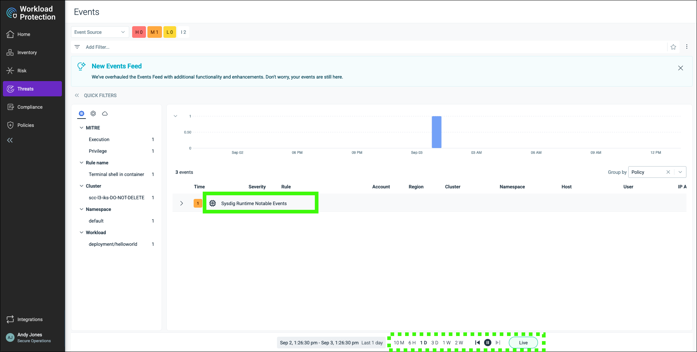

IBM Cloud Security and Compliance Center Workload Protection (WP) protects cloud native workloads, provides deep cloud and container visibility. SCC WP enhances an enterprise's posture management (compliance, benchmarks, Cloud Infrastructure Entitlements Management (CIEM)), vulnerability scanning, forensics, and threat detection and blocking. 

WP provides multi-cloud support for IBM Cloud, AWS, Google Cloud, Microsoft Azure, and can also be used for on-premises Kubernetes instances. However, in this guide, only resources in IBM Cloud are used.

In this scenario,

- view an existing attachment and results that utilize WP to scan cloud native applications
  
- use the WP dashboard to learn more about WP's capabilities 

### View an SCC attachment scan result focused on Kubernetes deployment

1. Open a web browser to the **IBM Cloud Portal**.

<a href="https://cloud.ibm.com" target="_blank">IBM Cloud Portal</a>.

When the page loads, authenticate with your IBM Cloud ID and password. The authentication process varies depending on the primary account that your ID is associated with and any multi-factor authentication or other security controls in place for the account.

2. Click the **account selection** drop-down menu and select the **{{itz.CloudAccount}}** account.


Note, if the browser window is narrow, you might see an **account selection** icon like this:  instead of the full account name.

3. Click the **Security and Compliance** icon () in the menu bar.
   


4. Click **Attachments** in the left menu.


5. Click the **ellipses** () icon for the **{{iks.Attachment}}** attachment and then click **View scan results**.


This attachment performs a scan based on the **IBM Cloud Kubernetes Service Benchmark** with these settings:


6. Click the link for the first scan in the table.


7. Explore the scan results by using what you learned earlier.


The results of this scan are similar to the results of the other scans that you explored earlier. You can expand the results for the **helloworld** application and describe the controls and assessments that are performed against that resource. 

### View more details by using the SCC WP dashboard

Now is a good time to transition to looking at the additional details and insights available in SCC WP.

8. Click the **Security and Compliance** link at the top of the page.


9.  Click **Integrations** in the left menu.


The setup of SCC WP is not covered in this scenario, but you can learn more about installing and configuring SCC WP <a href="https://cloud.ibm.com/docs/security-compliance?topic=security-compliance-setup-workload-protection" target="_blank">here</a>. 

10. Click the **Open dashboard** button.


The SCC WP dashboard opens in a new browser window or tab.


As you learned in the **{{level2learningplan.Name}}** seller enablement material, SCC WP is a rebranding of Sysdig (<a href="https://sysdig.com/" target="_blank">https://sysdig.com/</a>). This dashboard might look familiar to anyone who has used Sysdig in the past.

11. Hover over **Scanning** in the left menu and then click **Runtime**.


The **Runtime image scanning** page shows all the Kubernetes clusters that have been connected to the SCC WP instance and the images that are running in each cluster.

12. Click the expand icon () for the {{iks.ClusterName}} cluster.


We can narrow the view to individual clusters and individual namespaces in a cluster.

13. Click the **robot-shop** namespace of the **{{iks.ClusterName}}** cluster.


Notice there are images that failed the image scan test.


14. Click the **robotshop/rs-shipping** image.


15. Click the expand icon () next to **DefaultPolicy**.


In this case, the **Default Policy** is checking for specific vulnerabilities and Dockerfile instructions.

16. Click **Operating System** under **Vulnerabilities**.


We can view the vulnerabilities that are related to the **Operating System** (OS). Here we see all the vulnerabilities that are scanned and their Common Vulnerabilities and Exposures (CVE) ID.

17. Click the **High** and **Has fix** filters.


Filters can be used to narrow the view to vulnerabilities of certain severity and ones that have fixes that are available.

18. Click the **CVE-2022-22822** (or any of the vulnerabilities in the view).


We can drill down into a specific vulnerability and view more details about the specific vulnerability like what OS package the exposure is in.


SCC WP also scans for non-operating system vulnerabilities.

19. Click **Non-operating System** under **Vulnerabilities**.


These scans look at the libraries added to the base image like Python and Java. 


We can see that this image still has the Log4j vulnerability. The Log4j library controls how applications log strings of code and information. The vulnerability enables an attacker to gain control over a string and trick the application into requesting and running malicious code under the attacker's control.

20. Click **Java** under **Content**.


SCC WP also provides an inventory view of all the files that are associated with a package on the image.

21. Hover over **Scanning** and click **Image Results**.


Here we see a view of all the images that are scanned and our current security posture.


Other SCC WP vulnerability detection capabilities include the ability to scan image registries and schedule and receive reports and alerts through channels like email and slack. It also can deploy an **Admission Controller** to enable policies that control what images can and cannot be deployed to a cluster. For example, you can specify a policy to allow images with high, medium, and low, but not critical vulnerabilities. 

Information on these topics is available at the Sysdig documentation site:

- <a href="https://docs.sysdig.com/en/docs/sysdig-secure/scanning/integrate-with-container-registries/" target="_blank">Registries</a>
  
- <a href="https://docs.sysdig.com/en/docs/sysdig-secure/scanning/manage-scanning-alerts/" target="_blank">Alerts</a>

- <a href="https://docs.sysdig.com/en/docs/sysdig-secure/vulnerabilities/reporting/" target="_blank">Reports</a>

- <a href="https://docs.sysdig.com/en/docs/sysdig-secure/scanning/admission-controller/" target="_blank">Admission Controller</a>

SCC WP also provides Infrastructure as Code (IaC) security capabilities through integration with Git.

22. Hover over **Integrations** and then click **Git Integrations** in the left menu.


23. Click **Robot-shop**.


Here you see the integration with the Git repository for the robot-shop cloud native application that is deployed in the cluster.

With this integration, anytime a pull request is performed against the repository it is scanned for image vulnerabilities. If the scan fails, the pull request is blocked.

24. Hover over **Policies** and then click **Runtime Policies**.


SCC WP has standard runtime policies for kubernetes-based cloud native applications, including ones that are specific to 3rd party cloud providers like AWS, Azure, and Google.

These policies contain rules that detect known common threats or unexpected activities. SCC WP also allows clients to create custom policies.

25.  Click **Sysdig Runtime Notable Events**.



This Notable Events policy contains rules that might indicate undesired behavior. 

26.  Scroll through the list of rules and expand the **Terminal shell in container** rule.


Recall in the configuration step you did the **exec into pod**. Doing so triggered an event for this rule. Shortly, we will examine the event in more detail, but first look at all the rules in SCC WP.

27. Hover over **Policies** and then click **Rules** and then click **Rules Library**.



SCC WP has thousands of rules. The rules can be easily filtered by using tags. To view all the rules related to the MITRE ATT&CK (spelling is correct) framework, click one of the MITRE tags. Learn more about MITRE ATT&CK <a href="https://attack.mitre.org/" target="_blank">here</a>.

28.  Hover over **Events** and then click **Events Feed**.


29. Click the expand icon () next to **Sysdig Runtime Notable Events**.



If you don't see this event, you either did not complete the "Configure Workload Protection scenario" chapter of the demonstration guide, or you did so outside of the time frame that is currently displayed. Return to that chapter to have an event triggered or try adjusting the time frame at the bottom of the screen.

The number of **Sysdig runtime Notable Events** might vary from the image above. As this is a shared environment, others might have caused this event to be triggered. It doesn't matter which specific event you explore in the steps that follow.

30. Click  **kubernetes.cluster.name** under one of the **Terminal shell in container** events.


The details of the event are displayed in the new window. Knowing the event was triggered is potentially cause for concern and warrants more investigation.

31. Click **View Activity Audit**.


A new browser tab or window opens to the **Investigate** view in SCC WP for the selected event.


The audit view provides insights into all the commands that were run during the event.

32. Click the  icon.


This new view shows all the activity that occurred during the event.


While running the ```ps``` command is benign, what if you saw commands that copied and transferred sensitive data from the container? The **Activity Audit** can provide critical information about a malicious attack. The information can also be used to further identify more changes that should be made to the Kubernetes resources to prevent such attacks in the future.

That wraps up this scenario. Again, as mentioned earlier, SCC WP has more capabilities that we did not cover today, but hopefully you have a better understanding of the power SCC WP has in protecting your cloud native workloads and improving your security posture.

Watch a video of this scenario: COMING SOON

<!-- 
 -->