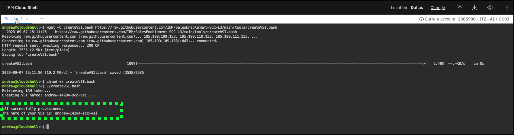
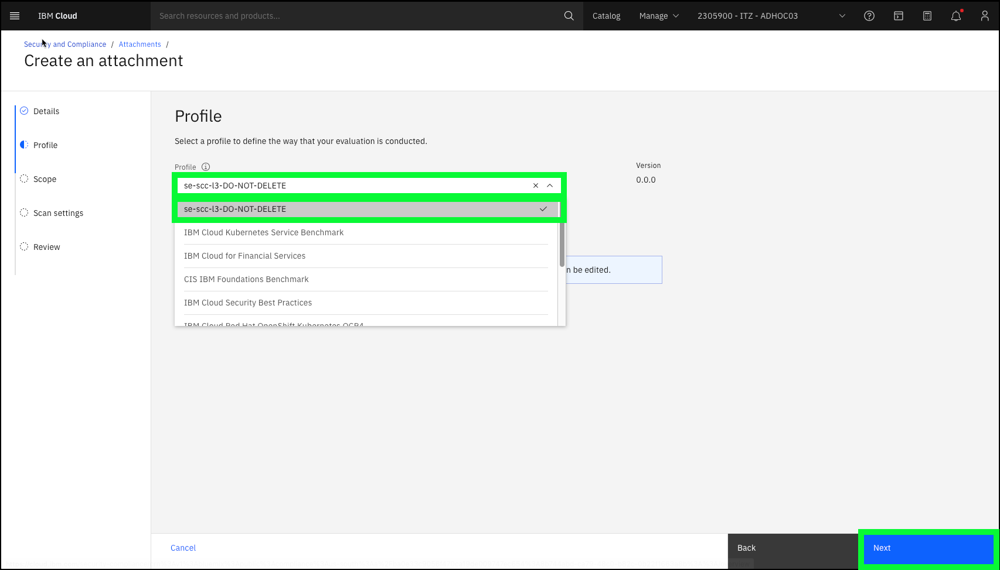

A compelling demonstration of IBM Cloud Security and Compliance Center (SCC) not only includes showing the results of a compliance scan, but also demonstrating how compliance failures can be remediated. In this demonstration guide, demonstrate how to remediate a failed compliance scan that is related to internet protocol (IP) address spoofing on a virtual server instance (VSI) running in an IBM Cloud Virtual Private Cloud (VPC). While IP address spoofing has legitimate business uses, it is also a potential vulnerability. Learn more about IP address spoofing <a href="https://en.wikipedia.org/wiki/IP_address_spoofing" target="_blank">here</a>. SCC has a predefined control that checks to see whether a VSI in a VPC has IP address spoofing enabled and flags those VSI's as noncompliant. This scenario was chosen as it is easy to enable and disable this setting on a VSI and VSI's in VPC are inexpensive resources which provision quickly. 

In the next steps:

  - provision a VSI instance with **IP network spoofing** enabled
  
  - create an SCC attachment that scans for VSIs with IP network spoofing enabled
  
  - run an initial scan

In the Client Demonstration section, you show the client the compliance failure that is related to the VSI you created, remediate the issue, rerun the scan, and show the new, successful compliance results.

### Provision a VSI with IP spoofing enabled
  
1. Open a web browser to the **IBM Cloud Portal**.

<a href="https://cloud.ibm.com" target="_blank">IBM Cloud Portal</a>

When the page loads, authenticate with your IBM Cloud ID and password. The authentication process varies depending on the primary account that your ID is associated with and any multi-factor authentication or other security controls in place for the account.

2. Click the **account selection** drop-down menu and select the **{{itz.CloudAccount}}** account.


Note, if the browser window is narrow, you might see an **account selection** icon like this:  instead of the full account name.

<!-- 3. Click the **VPC Infrastructure** icon () in the menu bar.
   


4. Click the **Virtual server instances** option in the left-hand menu.


5. Click **Create +**.


Note, you may see an **Authorization error** message on this screen. It can be ignored.


6. Enter a unique VSI **Name** in the **Details**  section.

As this is shared environment, it is important to specify a unique name for your VSI. As an example, name your VSI after yourself, like **arjones-vsi**. Note, VSI names must begin with a lower case letter and only alphanumeric characters and hyphens are allowed.


7. Verify all the other settings are as follows:

  **Architecture**: Intel
  
  **Location**: Geography = North America, Region = Dallas, Zone = Dallas 2
  
  **Resource group**: {{iam.ResourceGroup}}
  
  **Image**: CentOS, Image type = Stock image
  
  **Profile**: Balanced|bx2-2x8
  
  **SSH keys**: {{vpc.SSHkey}}
  
  **Virtual private cloud**: **{{vpc.Instance}}**.

  If these values are not the same, set them as shown.

  All of these should be the default values. All other fields should will either be empty or have generated values (e.g. Boot volume, Data volumes, etc.).

8. Click **Create virtual server**.


It should only take about a minute to provision the VSI. Once the VSI shows the status of **Running**, continue to the next steps.

9. Click the VSI name created earlier in the table of **Virtual server instances for VPC**.


10. Scroll down to the **Network interfaces** section and click the pencil icon () to edit the **eth0** network interface.


11. Click the **Allow IP spoofing** toggle button to set it to **Enabled** and then click **Save**.

 -->

3. Click the **IBM Cloud Shell** icon ()


A new browser window or tab will open with the IBM Cloud Shell. Proceed to the next step when the command prompt is ready (similar to the one highlighted below).


4. Copy and paste () the following commands to the IBM Cloud Shell window and press enter. 
   
The script calls the IBM Cloud command line interfaces to provision a VSI in a pre-provisioned VPC instance.

```
#
#
wget -O createVSI.bash {{guide.createVSIscript}}
chmod +x createVSI.bash
./createVSI.bash
```

Example output:



Take note of the name of the VSI created (highlighted above). Your VSI's name is the first part of your IBM Cloud user ID (typically email address) followed by a random number and **-scc-vsi**. For example: **andrew-14294-scc-vsi**

### Verify that the VSI was created with IP spoofing enabled

Return to the IBM Cloud browser window/tab.

5. Click the **VPC Infrastructure** icon () in the menu bar.
   


6. Click the **Virtual server instances** option in the left-hand menu.


7. Click your VSI's name in the table.


8. Scroll down to the **Network interfaces** section and verify that **Allow IP spoofing** is enabled.


### Create an SCC attachment and run an initial scan

In the steps that follow, using a pre-provisioned instance of SCC, you create an **attachment** which scans for VSIs on VPCs in a single IBM Cloud resource group to see whether **IP network spoofing** is enabled. When the **attachment** is saved, the first scan will automatically be performed.  

Recall in the scenario described earlier, we will show the failed compliance check (IP spoofing is disabled for all VSIs in VPCs), remediate the issue, and then rescan to show the compliance check is successful. It is important to understand that SCC cache's scan results for one hour. This means if you run the same scan within an hour of the last time the scan was run, a new scan is NOT performed and the old results are returned. This is important to remember when performing a client demonstration or if you are recording your Stand and Deliver. 

In the Client Demonstration section of this guide, you demonstrate how to view the scan results, remediate the issue, rerun the scan, and view the new results and the "drift" in compliance between the scans. More commentary is provided in that section of the guide. For now, follow the next steps to create the attachment and have the first scan run.

9. Navigate to the **SCC Dashboard** page in the IBM Cloud portal.


10. Click **Attachments** in the left-hand menu.


11. Click **Create +**.


12. Enter a unique **Name** for your attachment and then click **Next**.

Attachment names need to be unique. To avoid issues, it is suggested that you use a name similar to the VSI created earlier, for example: **andrew-14294-ipspoofing-compliance**.


13. Select **se-scc-l3-DO-NOT-DELETE** in the **Profile** pull-down menu and then click **Next**

You will examine the **se-scc-l3-DO-NOT-DELETE** profile in detail in the next section of the guide.



14. Select **SCC-L3** in the **Scope** pull-down menu and click **Next**.

You will learn more about the **Scope** setting in the next section of the guide.


15. Review the details on the **Scan settings** page and click **Next**.

For now, the default settings are fine, and will be explain in more details in the next section of the guide.


16. Review all the **attachment** settings and click **Create**.


The **attachment** is now saved and the initial scan is being run.


Notice the **Scan in progress** message for your attachment. Due to a user interface issue with this page (at least some browsers), this progress message remains on the screen until you refresh the page. As this is a simple scan of one control on a very limited scope, this scan takes a minute or two to run.  Wait a couple of minutes and then click the browser's refresh button and the **Next scan** information should be shown.


You can now proceed to the next chapter to learn about and configure IBM Cloud Event Notifications to enhance your client demonstration or continue to the next section to perform a client demonstration. While enabling IBM Cloud Event Notifications is optional, you are encouraged to at least read the introduction to learn more about IBM Cloud Event Notifications.