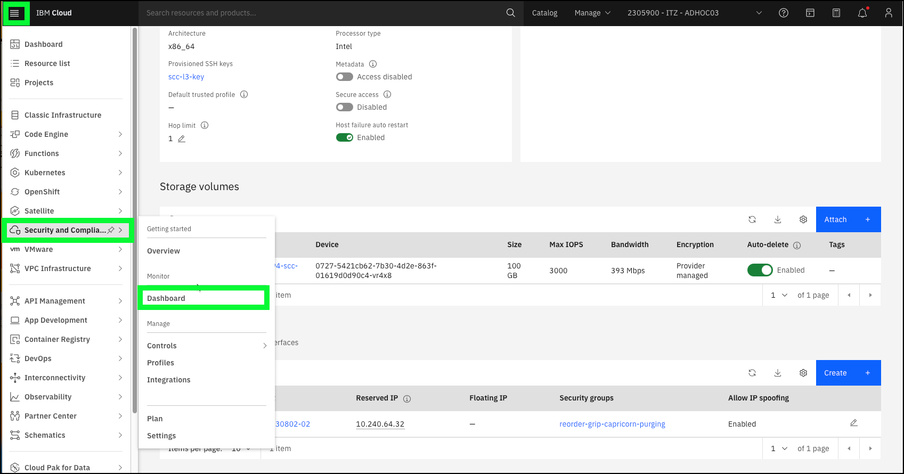

Before using the IBM Technology Zone (ITZ), a few additional configuration steps need to be performed. 

## Setup the remediation scenario

A compelling demonstration of IBM Cloud Security and Compliance Center (SCC) not only includes showing the results of a compliance scan, but also demonstrating how compliance failures can be remediated. In this demonstration guide, you will demonstrate how to remediate a failed compliance scan related to a VSI running in an IBM Cloud Virtual Private Cloud (VPC) and internet protocol (IP) network spoofing. While IP network spoofing has legitimate business uses, it is also a potential vulnerability. You can learn more about IP address spoofing <a href="https://en.wikipedia.org/wiki/IP_address_spoofing" target="_blank">here</a>. SCC has a predefined control that checks to see if a VSI in a VPC has IP network spoofing enabled and flags those VSI's as non-compliant. This scenario was chosen as it is easy to turn this setting on and off of a VSI and VSI's in VPC are inexpensive resources. 

In the next steps:

  - provision a VSI instance
  
  - enable **IP network spoofing** on the VSI
  
  - create a SCC attachment that scans for VSIs with IP network spoofing enabled
  
  - run an initial scan

In the actual demonstration section of this demonstration guide, you will show the client the compliance failure related to the VSI you created, remediate the issue, re-run the scan, and show the new, successful compliance results.

### Provision a VSI with IP spoofing enabled
  
1. Open a web browser to the **IBM Cloud Portal**.

<a href="https://cloud.ibm.com" target="_blank">IBM Cloud Portal</a>.

When the page loads, authenticate with your IBM Cloud ID and password. The authentication process varies depending on the primary account that your ID is associated with and any multi-factor authentication or other security controls in place for the account.

2. Click the **account selection** drop-down menu and select the **{{itz.CloudAccount}}** account.

Note, if the browser window is narrow, you might see an **account selection** icon like this:  instead of the full account name.

3. Click the **VPC Infrastructure** icon () in the menu bar.
   

4. Click the **Virtual server instances** option in the left-hand menu.

5. Click **Create +**.

Note, you may see an **Authorization error** message on this screen. It can be ignored.

6. Enter a unique VSI **Name** in the **Details**  section.

As this is shared environment, it is important to specify a unique name for your VSI. As an example, name your VSI after yourself, like **arjones-vsi**. Note, VSI names must begin with a lower case letter and only alphanumeric characters and hyphens are allowed.

7. Verify all the other settings are as follows:

  **Architecture**: Intel
  
  **Location**: Geography = North America, Region = Dallas, Zone = Dallas 2
  
  **Resource group**: {{iam.ResourceGroup}}
  
  **Image**: CentOS, Image type = Stock image
  
  **Profile**: Balanced|bx2-2x8
  
  **SSH keys**: {{vpc.SSHkey}}
  
  **Virtual private cloud**: **{{vpc.Instance}}**.

  If these values are not the same, set them as shown.

  All of these should be the default values. All other fields should will either be empty or have generated values (e.g. Boot volume, Data volumes, etc.).

8. Click **Create virtual server**.

It should only take about a minute to provision the VSI. Once the VSI shows the status of **Running**, continue to the next steps.

9. Click the VSI name created earlier in the table of **Virtual server instances for VPC**.

10. Scroll down to the **Network interfaces** section and click the pencil icon () to edit the **eth0** network interface.

11. Click the **Allow IP spoofing** toggle button to set it to **Enabled** and then click **Save**.

### Create a SCC attachment and run an initial scan

1. Navigate to the **SCC Dashboard** page in the IBM Cloud portal.

## Enable SMS notifications (Optional)

SCC can integrate with IBM Cloud Event Notifications which is used to send notifications to users via e-mail, SMS, or other supported notification channels. The ITZ environment for this demonstration guide is enabled with IBM Cloud Event Notifications. Step-by-step instructions for enabling SMS notifications to your personal mobile device are provided below. To learn about provisioning IBM Cloud Event Notifications and configuration SCC to use it, read the documentation <a href="https://cloud.ibm.com/docs/security-compliance?topic=security-compliance-event-notifications&interface=ui" target="_blank">here</a>.

This is an optional task for the Level 3 learning plan requirements. Follow these steps to add SMS notifications as part of your demonstration. 

1. Open a web browser to the **IBM Cloud Portal**.

<a href="https://cloud.ibm.com" target="_blank">IBM Cloud Portal</a>.

When the page loads, authenticate with your IBM Cloud ID and password. The authentication process varies depending on the primary account that your ID is associated with and any multi-factor authentication or other security controls in place for the account.

2. Click the **account selection** drop-down menu and select the **{{itz.CloudAccount}}** account.

Note, if the browser window is narrow, you might see an **account selection** icon like this:  instead of the full account name.

3. Click the **Security and Compliance** icon () in the menu bar.
   

4. Click **Settings** in left-hand menu.

5. Click the **{{en.Instance}}** link under **Event Notifications**. 

Don't worry about the **Missing authorization** message in the Storage section. In this ITZ environment, your ID does not have permissions to view this information. Rest assured that the environment is properly configured.

A new browser window or tab will be opened.

6. Click **Subscriptions** in left-hand menu.

7. Click the three ellipses icon () for the **{{en.Subscription}}** entry in the table and then click **Edit**.

8. Enter your SMS enabled mobile device number in the **Phone numbers** dialog, and then click the **Add +** button in the **Recipients** section of the **Subscription details** dialog.

The mobile device number you enter must be in the proper format. Numbers should being with + and country code. Use the **Learn more** link in the dialog if you are unsure of the proper format.

!!! Important "Do not change anything else on this page"
    The IAM permissions required to add mobile device numbers to a subscription also allow users to modify the subscription topic and name. Please do not change these values as this will negatively affect other IBM and Business Partner sellers using this demonstration environment.

9. Click **Save**.

Shortly after saving the subscription, a SMS message should be received on your mobile device. You must click the link provided to continue to receive the SMS message notifications. You can unsubscribe at anytime.

10. Click the verification link in the SMS message on your mobile device.

Note, the above image was taken from a Apple iPhone mobile device. It may look different on other devices.

A new browser window or tab will open on your mobile device.

11. Click **Confirm**.

12. Upon receiving the **Successfully Subscribed** message, close the window on your mobile device.

13. Return to the Event Notification's Subscriptions browser window and close it.

You are ready to proceed to the next section of this demonstration guide to learn how to perform a client demonstration. 