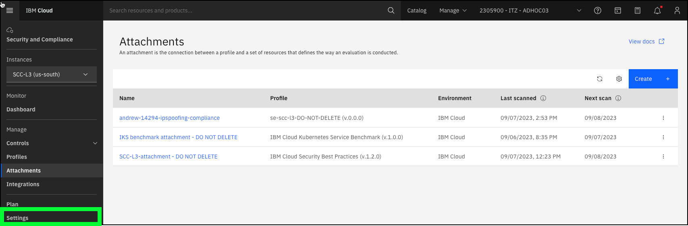
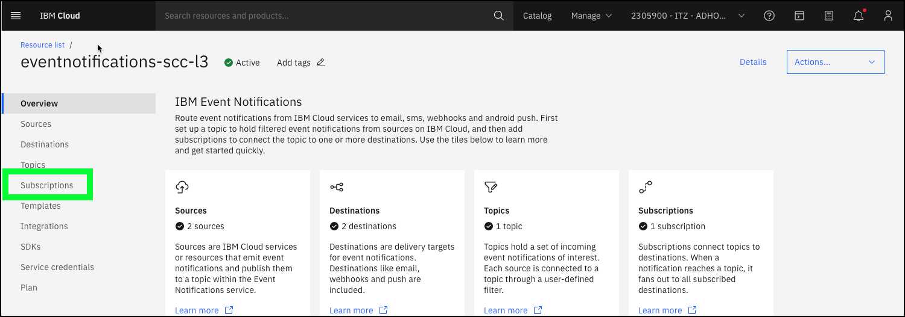
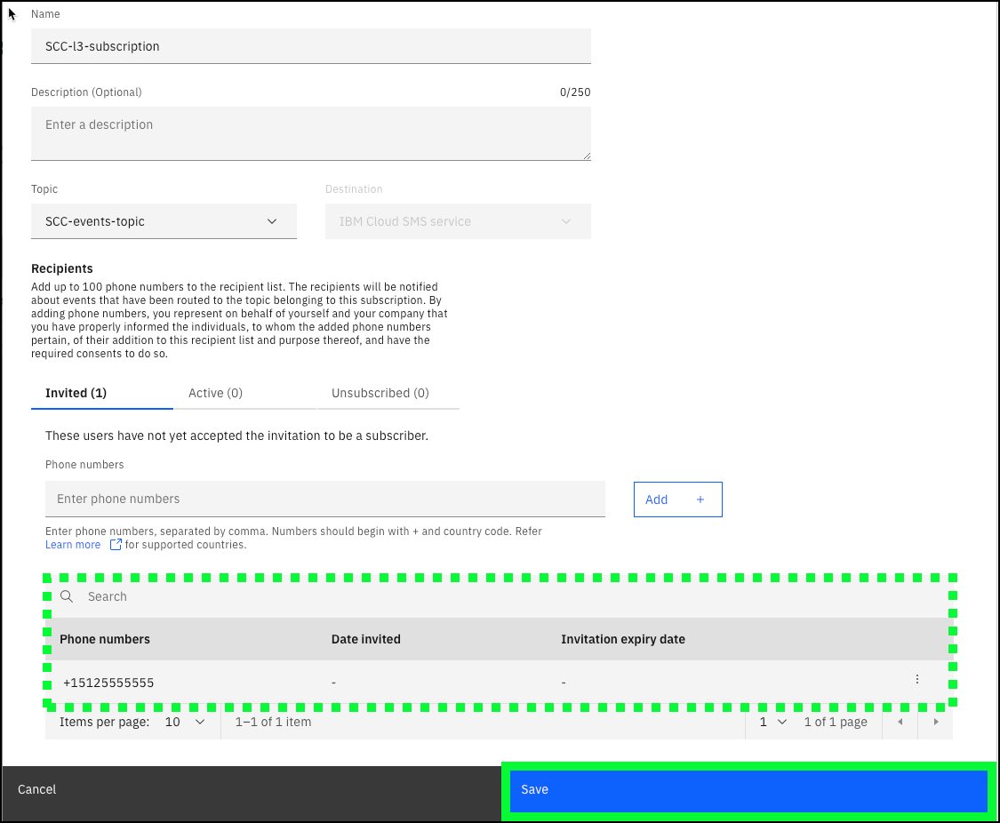
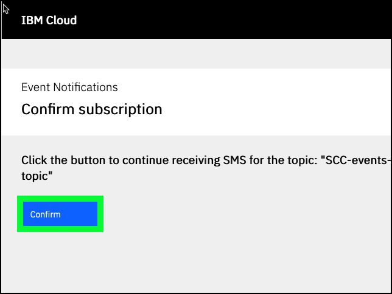
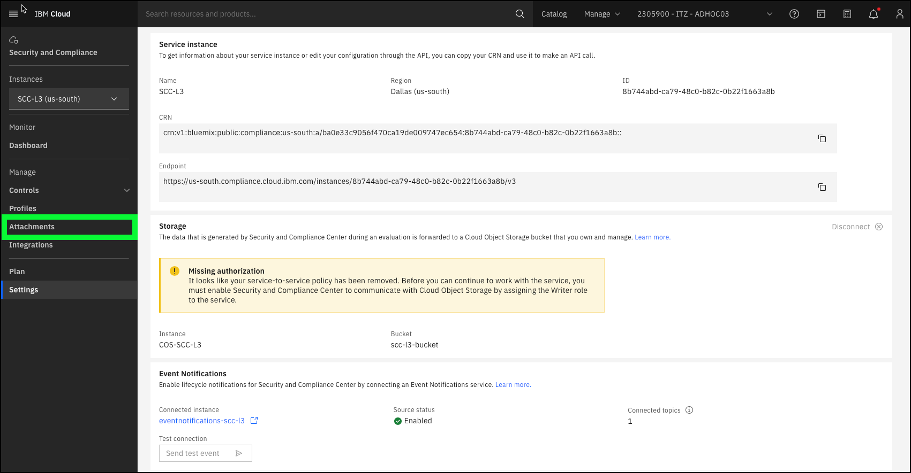
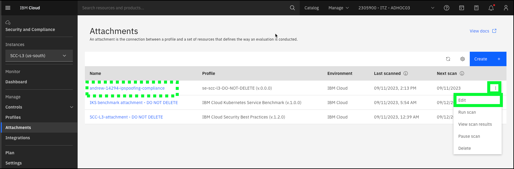
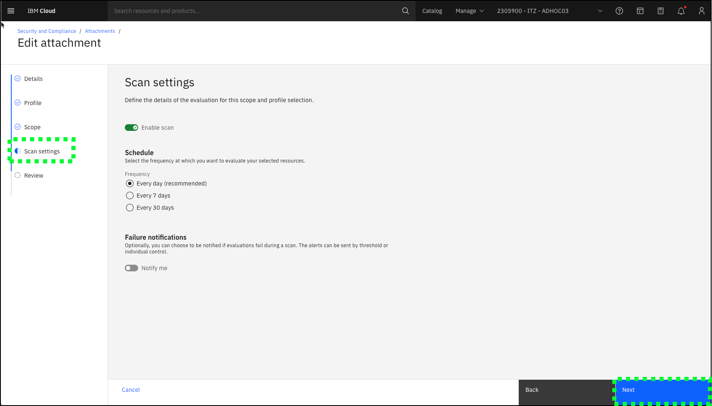
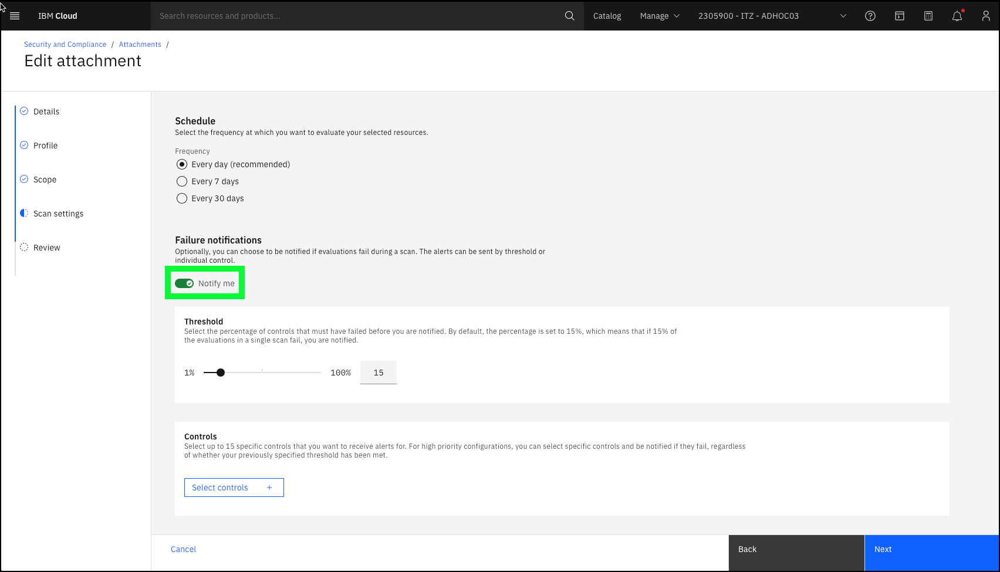
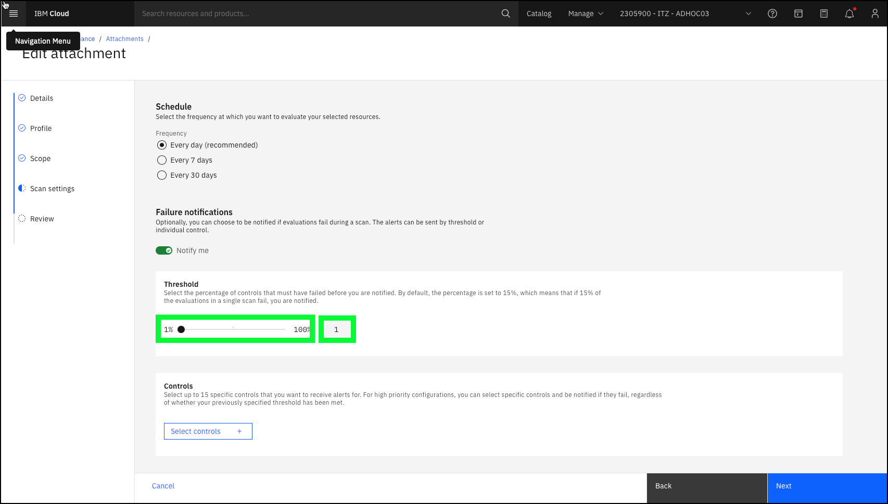

!!! Bug "The pre-provisioned Event Notification instance is throwing an error when an attempt is made to edit the subscription."

    A ticket has been opened with IBM Cloud on Oct. 7, 2024 for this issue. This message will be removed once the issue is resolved. Until then, you will NOT be able to complete this section. You are encouraged to read through the steps to understand the process.

This is an optional task for the Level 3 learning plan requirements. 

IBM Cloud Security and Compliance Center (SCC) can integrate with IBM Cloud Event Notifications, which is used to send notifications to users via email, SMS, or other supported notification channels (recall the **Notify me** toggle in the **Scan settings** page when creating an attachment). The ITZ environment for this demonstration guide is enabled with IBM Cloud Event Notifications. Step-by-step instructions for enabling SMS notifications to your personal mobile device are provided below. To learn about provisioning IBM Cloud Event Notifications and configuration SCC to use it, read the documentation <a href="https://cloud.ibm.com/docs/security-compliance?topic=security-compliance-event-notifications&interface=ui" target="_blank">here</a>.

Follow these steps to add SMS notifications as part of your demonstration. 

<!-- 
1. Open a web browser to the **IBM Cloud Portal**.

<a href="https://cloud.ibm.com" target="_blank">IBM Cloud Portal</a>.

When the page loads, authenticate with your IBM Cloud ID and password. The authentication process varies depending on the primary account that your ID is associated with and any multi-factor authentication or other security controls in place for the account.

2. Click the **account selection** drop-down menu and select the **{{itz.CloudAccount}}** account.

Note, if the browser window is narrow, you might see an **account selection** icon like this:  instead of the full account name.

3. Click the **Security and Compliance** icon () in the menu bar.
   
 -->

1. Click the **Settings** option in the left-hand menu of the Security and Compliance page.

 

2. Click the **{{en.Instance}}** link under **Event Notifications**. 

Don't worry about the **Missing authorization** message in the Storage section. In this ITZ environment, your ID does not have permission to view this information. Rest assured that the environment is properly configured.

A new browser window or tab will open.

3. Click **Subscriptions** in the left-hand menu.

4. Click the three ellipses icon () for the **{{en.Subscription}}** entry in the table and then click **Edit**.

5. Enter your SMS enabled mobile device number in the **Phone numbers** dialog, and then click the **Add +** button in the **Recipients** section of the **Subscription details** dialog.

The mobile device number that you enter must be in the proper format. Numbers should begin with + and country code. Use the **Learn more** link in the dialog if you are unsure of the proper format.

!!! Important "Do not change anything else on this page"
    The IAM permissions that are required to add mobile device numbers to a subscription also allow users to modify the subscription topic and name. Do not change these values as this will negatively affect other IBM and Business Partner sellers that use this demonstration environment.

6. Click **Save**.

Shortly after saving the subscription, an SMS message should be received on your mobile device. You must click the link that is provided to continue to receive the SMS message notifications. You can unsubscribe at any time.

7. Click the verification link in the SMS message on your mobile device.

Note, the above image was taken from an Apple iPhone. It might look different on other mobile devices.

A new browser window or tab opens on your mobile device.

8. Click **Confirm**.

9. Upon receiving the **Successfully Subscribed** message, close the window on your mobile device.

10. Return to the Event Notification's Subscriptions browser window and close it.

Note, the scan you created earlier is not enabled to send notifications. Edit that scan and enable notifications.

11. Return to the browser window or tab with the SCC **Settings** page and click the **Attachments** option in left-hand menu.

12. Click the ellipses icon () of the **Attachment** you created earlier and then click **Edit**. In this example, **andrew-14294-ipspoofing-compliance**.

13. Click **Next** three times until you reach the **Scan settings** page.

14. Click the **Notify me** toggle button in the **Failure notifications** section.

15. Enter **1** in the **Threshold** entry field (or move the % slide to the far left).

Setting the threshold to 1% will ensure a notification is sent when the issue has been remediate on at least one resource.

16. Click **Next** and then click **Save** to save the changes to your attachment.

You are now ready to proceed to the next section to learn how to perform a client demonstration. 