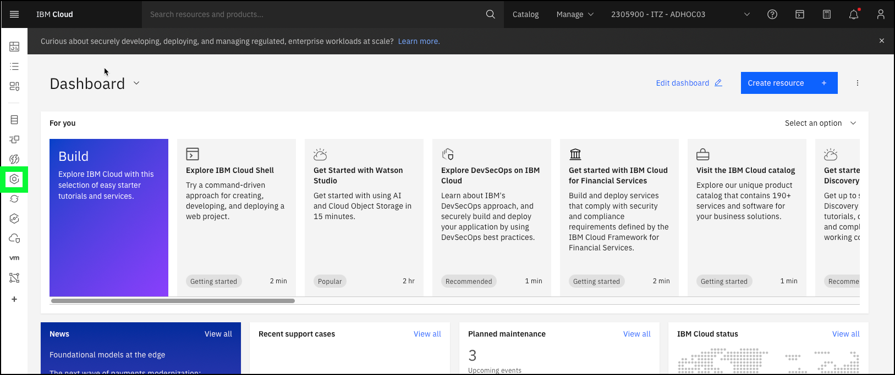
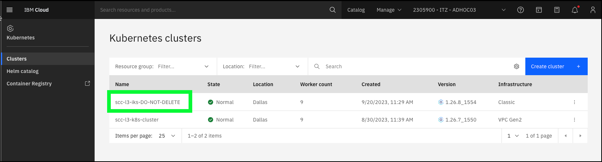
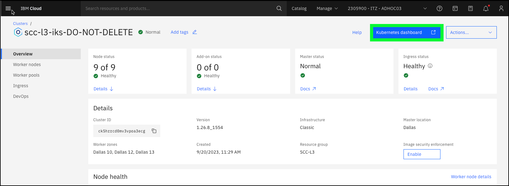
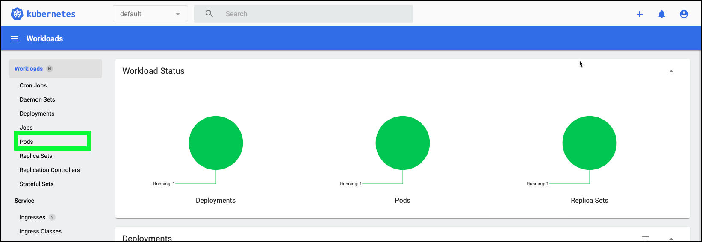
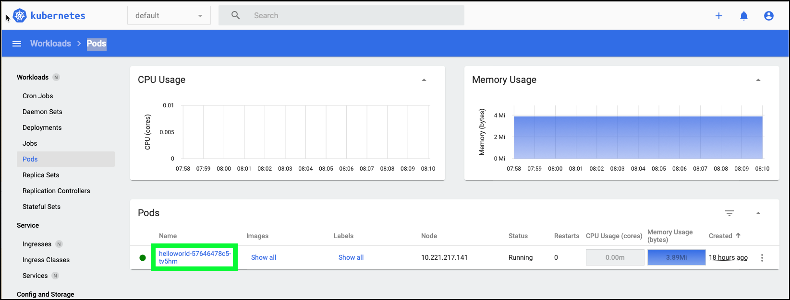
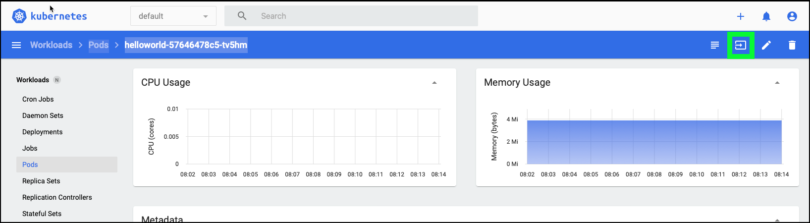
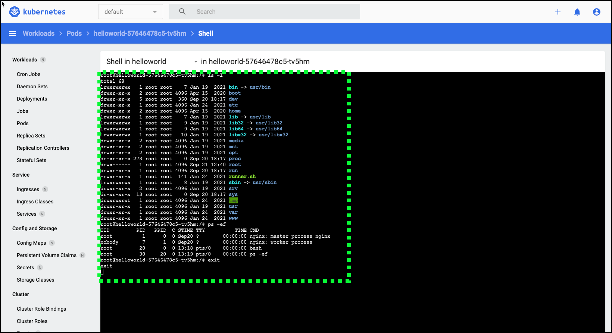

In the Client Demonstrations section, you show the client how IBM Cloud Security and Compliance Center (SCC) Workload Protection (WP) can detect a potential threat. 

To set up this scenario:

  - using the IBM Cloud portal, access a Kubernetes pod by using the "exec" command
  
  - run a couple of commands in the pod
  
### Access the Kubernetes pod and run several commands
  
1. Open a web browser to the **IBM Cloud Portal**.

<a href="https://cloud.ibm.com" target="_blank">IBM Cloud Portal</a>

2. Click the **account selection** drop-down menu and select the **{{itz.CloudAccount}}** account.


Note, if the browser window is narrow, you might see an **account selection** icon like this:  instead of the full account name.

3. Click the **Kubernetes** icon () in the left menu.



4. Click **{{iks.ClusterName}}** in the table of clusters.



5. Click the **Kubernetes dashboard** button.



The **Kubernetes dashboard** loads in a new browser tab or window.

6. Click **Pods** in the left menu.



7. Click the **{{iks.Pod}}** link in the **Pods** table.



8. Click the **Exec into pod** ().



9. Copy () and paste **(Ctrl v)** the commands that follow in the **Shell** window.

```
ls -l
ps -ef
exit

```



The commands above do a simple listing of the contents of the current directory and lists the running processes. 

The ability to **exec** into a running pod is a potential security vulnerability that bad actors might use to perform nefarious acts. Attackers with permissions might run ‘kubectl exec’ (the command line equivalent to what was performed above) to run malicious code and compromise resources within a cluster.

In the "High-level demonstration of Workload Protection" chapter you see an event was triggered based on the action you performed and demonstrate how WP can detect threats.