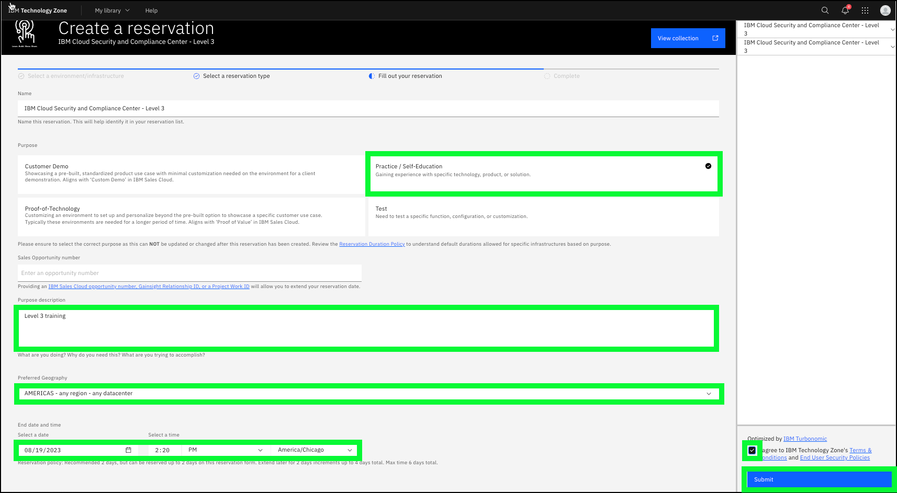

To access the pre-provisioned IBM Cloud Security and Compliance Center (SCC) instance, you must first create a reservation for the environment in IBM Technology Zone (ITZ).

## Create a reservation for the demonstration environment in ITZ

1. Open a web browser to the **IBM Cloud Security and Compliance Center - Level 3** environment reservation page.
   
   <a href="https://techzone.ibm.com/my/reservations/create/64de55a2f0429d0017267c02" target="_blank">Create a reservation</a>.
   
   Follow the authentication prompts using your IBM Cloud identification (ID). These steps vary for IBMers and Business Partners and are not illustrated here.
   
   Note: you might need to accept the latest ITZ terms and conditions before proceeding.

2. Click the **Reserve now** radio button.
3. Click the **Practice / Self Education** tile.
4. Enter **Level 3 training** in the **Purpose description** field.
5. Click the **Preferred Geography** pull-down and select **AMERICAS - any region - any datacenter**.

The SCC resources that are used in this demonstration environment are all provisioned in the US South region. There is no benefit to selecting a different location.

The **End date and time** is set for 2 days. You can shorten that duration here. After the reservation is ready, you can also extend the reservation up to a maximum of 6 days once created.

6. Click the **I agree to IBM Technology Zone's T&Cs** checkbox.
7. Click **Submit**.

It takes approximately 20 minutes for the reservation to be processed. You can monitor the progress of the reservation <a href="https://techzone.ibm.com/my/reservations" target="_blank">here</a>.

When the status of the reservation is **Ready**, continue to the next chapter of this demonstration guide to learn how to access the environment.