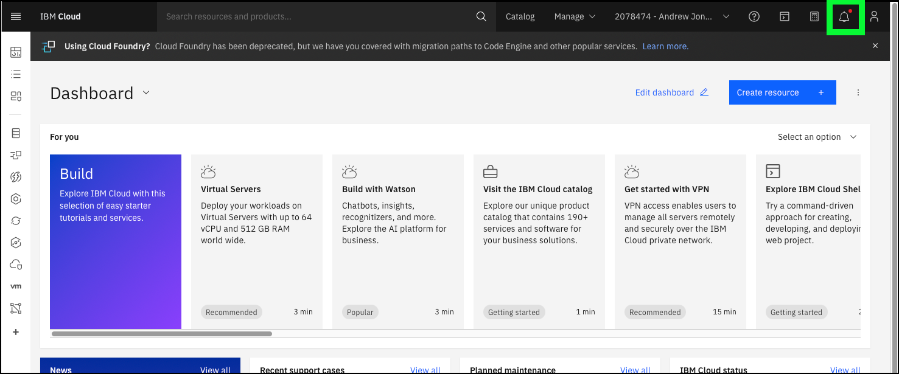

To access the the pre-provisioned IBM Cloud Security and Compliance Center (SCC) instance, you must first create a reservation for the environment in IBM Technology Zone (ITZ).

##
## Create a reservation for the demonstration environment in ITZ

1. Open a web browser to the **IBM Cloud for VMware Solutions - Level 3** environment reservation page.

   <a href="https://techzone.ibm.com/my/reservations/create/???" target="_blank">Create a reservation</a>.

   Follow the authentication prompts using your IBM Cloud identification (ID). These steps will vary for IBMers and Business Partners and are not illustrated here.

   Note: you may need to accept the latest ITZ terms and conditions before proceeding.

2. Click the **Reserve now** radio button.
3. Click the **Practice / Self Education** tile.
4. Enter **Level 3 training** in the **Purpose description** field.
5. Click the **Preferred Geography** pull-down and select **AMERICAS - us-south region -dal10 datacenter**.

The **End date and time** is set for 3 days. You can shorten that direction here. After the reservation is ready, you can also extend the reservation up to a maximum of 6 days.

6. Click the **I agree to IBM Technology Zone's T&Cs** checkbox.
7. Click **Submit**.

It takes approximately 20 minutes for the reservation to be processed. You can monitor the progress of the reservation <a href="https://techzone.ibm.com/my/reservations" target="_blank">here</a>.

When the status of the reservation is **Ready**, continue to the next 

1. Open a web browser to the **IBM Cloud Portal**.

<a href="https://cloud.ibm.com" target="_blank">Create a reservation</a>.

When the page loads, authenticate with your IBM Cloud ID and password. The authentication process varies depending on the primary account that your ID is associated with and any multi-factor authentication or other security controls in place for the account.

2. Click the **Notifications** () icon.

3. Click the **Join now** link on the **Action required: You are invited to join an account in IBM Cloud** notification.

Note: if you do not see a notification like this, then, in most cases, your ITZ reservation is not in the **Ready** state. Wait for the reservation to become **Ready**. You will also receive an email with the **Join now** link.

4. Click the **I accept the product...** checkbox.
5. Click **Join Account**.

6. Click the **account selection** drop-down menu and select the **{{itz.account}}** account.

Note, if the browser window is narrow, you might see an **account selection** icon like this:  instead of the full account name.