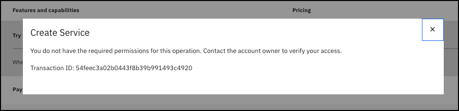

For this demonstration guide, you will leverage a pre-provisioned IBM Cloud Security and Compliance Center (SCC) instance. To access the instance, you will need to create a reservation an IBM Technology Zone (ITZ) environment dedicated to this learning plan. 

There are several advantages of leveraging a pre-provisioned SCC instance including being able to see historical SCC scans of resources that would not be available if a new instance was provisioned. Additionally, since all users of this learning plan utilize the same environment there is a cost savings to IBM. 

!!! Warning "This is a shared environment, and you will have limited access to creating resources."

    Since this is a shared environment, your IBM Cloud identification (ID) will have limited access. For instance, you will not be able to provision a new SCC instance, but you will be able to create things like rules and attachments, initiate scans, and view the SCC dashboard. Attempts to perform actions you do not have permissions for will result in an error like:

    
    
    Please remember to delete any resources you provision as part of this learning plan!

In the next chapter, learn how to make a reservation for the ITZ environment.