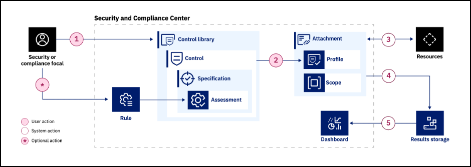

# {{guide.Name}}

Welcome to the demonstration guide for the {{learningplan.Name}} learning plan. In this Level 3 course, you will learn how to demonstrate IBM Cloud Security and Compliance Center (SCC) and IBM Cloud Security and Compliance Center Workload Protection (WP) to clients. 

!!! tip "ACCREDITATION"
    
    To receive Level 3 accreditation, IBMers and Business Partners must demonstrate mastery of the skills learned throughout the various sections of this demonstration guide. Level 3 accreditation requirements— and the way participants will be evaluated before receiving accreditation —differs depending on job role.

    **Business Partners** must pass an accreditation quiz after completing the hands-on portion of the course. The quiz consists of multiple choice questions, with four possible responses (and only one correct answer) for each question. **Hint: keep the demonstration guide and the associated IBM Technology Zone (TechZone) environment active while completing the quiz. Watch for the "BP quiz question"  icon in the demonstration guide.**

    **IBM Sales and Tech Sales** must develop and record a Stand & Deliver presentation. This video is intended to simulate your delivery of a “live” demo in front of a client — on camera. IBMers will have flexibility in defining a hypothetical client, the pain points that customer has, and the goals they aspire to achieve. The recording will then cover the seller’s hands-on demonstration and pitch to the client of the value of the IBM solution using the environments and techniques of this lab.

    Specific criteria that must be demonstrated as part of the Stand & Deliver recordings is provided within the documentation that accompanies the Level 3 course in YourLearning.

Before starting this learning plan, it is highly recommended that you complete the {{level2learningplan.Name}} learning plan as that base knowledge is assumed for this course. The Level 2 courses can be found here:

- IBMers: <a href="{{level2learningplan.YLurl}}" target="_blank">{{level2learningplan.YLurl}}</a>
- Business Partners: <a href="{{level2learningplan.BPurl}} target="_blank">{{level2learningplan.BPurl}}</a>

Another excellent resource is the <a href="https://pages.github.ibm.com/IBM-Cloud-Satellite-and-PaaS-Community/technology-pattern-scc/" target="_blank">IBM Technology Patterns for Regulated Cloud workloads</a>. This web site includes use cases, client stories, and other seller enablement. The site also includes additional assets for demos and labs related to SCC. These assets include reservable IBM Technology Zone (ITZ) environments. These environments are excellent options for proof-of-concepts and the like for individualized client engagements. This differs from the environment used for this learning plan. The ITZ environment for this learning plan utilizes pre-provisioned resources in a shared environment allowing sellers and technical sellers to very quickly have access to a demonstration environment without the need for time-consuming provisioning and configuration tasks.

TBW: ONCE FINALIZED ADD MORE SPECIFIC SUMMARY OF WHAT THE DEMO WILL CONSIST OF FOR SALES AND FOR TECHNICAL SALES (E.G. PROTECT WORKLOADS, SECURITY AND COMPLIANCE MANAGEMENT, ASSESS 3RD & 4TH PARTY RISK,). WILL NOT HAVE  HYBRID MULTI-CLOUD STRATEGY IN THIS ENVIRONMENT, BUT CAN BE MENTIONED IN WP SECTION.

Every good client demonstration should tell a story the client can relate to. This may be a particular pain point the client is experiencing or a common industry scenario. SCC includes both industry specific (e.g. Financial Services), cross industry controls, and the ability to build custom controls. When performing an actual client demonstration, sellers should focus on the controls most relevant to the client. Refer to the afore mentioned technology pattern for more information on SCC use cases. Additionally, if you know what IBM Cloud resources the client is already using, validate if those resources can be evaluated by SCC. Find the current list of resources that can be evaluated by SCC <a href="https://cloud.ibm.com/docs/security-compliance?topic=security-compliance-scannable-components&interface=ui" target="_blank">here</a>.

In addition to the Level 2 training and the Technology Pattern, all sellers and technical sellers are encouraged to read the <a href="https://cloud.ibm.com/docs/security-compliance?topic=security-compliance-getting-started&interface=ui" target="_blank">SCC documentation</a>. The documentation contains a wealth of information that is not covered in the Level 2 or Level 3 training including topics like:

  - SCC's underlying architecture. Did you know SCC is a multi-tenant solution?
  - High availability (HA) and disaster recover (DR)
  - Protecting SCC resources with context-based restrictions

## Key SCC Concepts
Before continuing review the following key concepts associated with SCC. Additional details on these and other SCC-related concepts can be found <a href="https://cloud.ibm.com/docs/security-compliance?topic=security-compliance-posture-management" target="_blank">here</a>.

**Control** - A technical, administrative, or physical safeguard that is designed to meet a set of defined security and privacy requirements. Controls exist to prevent, detect, or lessen the ability of a threat to exploit a vulnerability.

**Specification** - A statement that defines the specific security and privacy requirements that a control must meet.

**Control Library** - A collection of predefined or custom controls. Control libraries show all the controls in an account that are available to be evaluated. A library is helpful for organizing and versioning controls. 

**Profile** - A group of controls that are related to a specific compliance objective. Although very similar in structure to a control library, a profile can be attached to a set of resources and be evaluated. 

**Assessment** - The actual evaluation of a configuration for compliance with applicable standards. An assessment can be either automated or manual depending on the control. 

**Rule** - A set of conditional statements that are used to determine whether a resource configuration is in compliance. To evaluate a rule, it must be associated with a profile through an assessment.

**Parameter** - The specific configuration property that is evaluated. Each parameter is assigned a value by default that can be customized when an attachment is created. For example, if a control evaluates which region that a resource exits in, you can specify the region that you want to check for by defining the parameter.

**Attachment** - The connection between a profile and scope that defines the way that SCC conducts an evaluation. An attachment is formed by selecting the grouping of resources to be evaluates and a profile. Then, you specify the parameters that you want to evaluate for. Attachments are evaluated once per day or can be initiated as needed.

These concepts can be visualized in these steps:

1. A security or compliance focal specifies the controls to be enabled.  This is done by selecting a pre-defined profile (e.g. IBM Cloud Security Best Practices, IBM Cloud for Financial Services, etc.) or creating a custom profile with specific controls. Optionally, the focal could create custom rules.
2. Next, the focal creates an attachment of the profile. The attachment defines the scope of resources to be scanned along with any optional, customized parameters for specific controls.
3. Once saved, the initial scan of the attachment is performed against the scoped resources. Scan's are typically done on a daily basis, weekly, or monthly basis, but can also be run ad-hoc.
4. The results of the scan or stored in a IBM Cloud Object Storage (COS) specified by the client when the SCC instance is created.
5. And finally, the results are made accessible through the SCC Dashboard in the IBM Cloud Portal.

In the next sections of this demonstration guide learn how to demonstration SCC to clients using the flow above along with sample talking points and a few additional demonstration ideas that may be relevant to specific client audiences.